Garchinger Heide and restoration sites: <br> Red List Germany
================
<b>Sina Appeltauer, Markus Bauer</b> <br>
<b>2025-07-30</b>

- [Preparation](#preparation)
- [Statistics](#statistics)
  - [Data exploration](#data-exploration)
    - [Means and deviations](#means-and-deviations)
    - [Graphs of raw data (Step 2, 6,
      7)](#graphs-of-raw-data-step-2-6-7)
    - [Outliers, zero-inflation, transformations? (Step 1, 3,
      4)](#outliers-zero-inflation-transformations-step-1-3-4)
    - [Check collinearity part 1 (Step
      5)](#check-collinearity-part-1-step-5)
  - [Models](#models)
  - [Model check](#model-check)
    - [DHARMa](#dharma)
    - [Check collinearity part 2 (Step
      5)](#check-collinearity-part-2-step-5)
  - [Model comparison](#model-comparison)
    - [<i>R</i><sup>2</sup> values](#r2-values)
    - [AICc](#aicc)
  - [Predicted values](#predicted-values)
    - [Summary table](#summary-table)
    - [Forest plot](#forest-plot)
    - [Effect sizes](#effect-sizes)
- [Session info](#session-info)

<br/> <br/> <b>Sina Appeltauer</b>, <b>Malte Knöppler</b>, <b>Maren
Teschauer</b> & <b>Markus Bauer</b>\*

Technichal University of Munich, TUM School of Life Sciences, Chair of
Restoration Ecology, Emil-Ramann-Straße 6, 85354 Freising, Germany

\*<markus1.bauer@tum.de>

ORCiD ID: [0000-0001-5372-4174](https://orcid.org/0000-0001-5372-4174)
<br> [Google
Scholar](https://scholar.google.de/citations?user=oHhmOkkAAAAJ&hl=de&oi=ao)
<br> GitHub: [markus1bauer](https://github.com/markus1bauer) <br>
GitHub:
[TUM-Restoration-Ecology](https://github.com/TUM-Restoration-Ecology)

To compare different models, you only have to change the models in
section ‘Load models’

# Preparation

Protocol of data exploration (Steps 1-8) used from Zuur et al. (2010)
Methods Ecol Evol
[DOI:10.1111/2041-210X.12577](https://doi.org/10.1111/2041-210X.12577)

#### Packages

``` r
library(here)
library(tidyverse)
library(ggbeeswarm)
library(patchwork)
library(DHARMa)
library(emmeans)
```

#### Load data

``` r
sites <- read_csv(
  here("data", "processed", "data_processed_sites.csv"),
  col_names = TRUE, na = c("", "na", "NA"), col_types = 
    cols(
      .default = "?",
      year_hay_transfer = "f",
      treatment = col_factor(
        levels = c("control_2003", "control_2018", "control_2021", "cut_summer",
                   "cut_autumn", "topsoil_removal")
      )
    )
  ) %>%
    mutate(
    year_hay_transfer = if_else(
      is.na(year_hay_transfer), "no", year_hay_transfer
      )
    ) %>%
  rename(y = rlg)

subset <- sites %>%
  mutate(
    hay_and_mowing_date = str_c(
      year_hay_transfer, mowing_date, sep = "_"
      )
    ) %>%
  filter(
    is.na(hay_and_mowing_date) | !(hay_and_mowing_date %in% c("1993_summer")),
    is.na(year_topsoil_removal) | year_topsoil_removal != "1996/2003"
    )
```

# Statistics

## Data exploration

### Means and deviations

``` r
Rmisc::CI(sites$y, ci = .95)
```

    ##    upper     mean    lower 
    ## 17.04167 16.29870 15.55573

``` r
median(sites$y)
```

    ## [1] 17

``` r
sd(sites$y)
```

    ## [1] 5.731071

``` r
quantile(sites$y, probs = c(0.05, 0.95), na.rm = TRUE)
```

    ##  5% 95% 
    ##   7  24

### Graphs of raw data (Step 2, 6, 7)

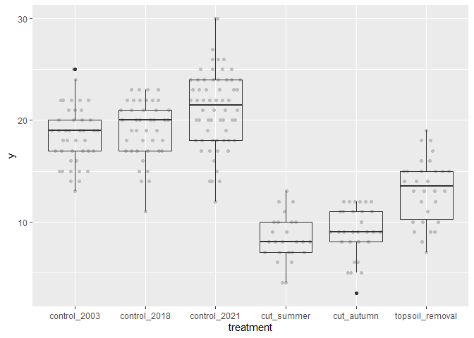<!-- -->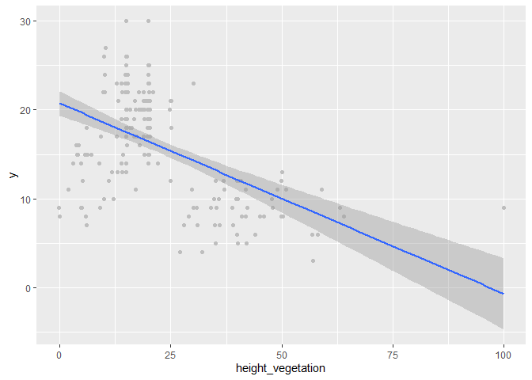<!-- -->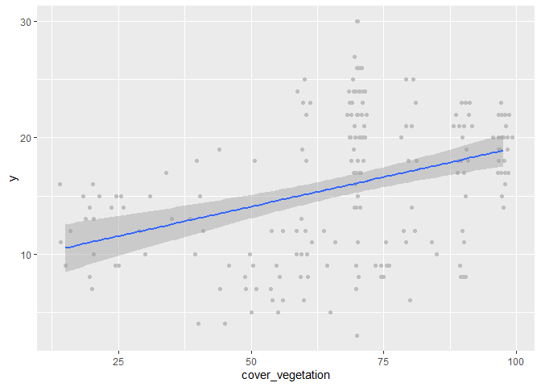<!-- -->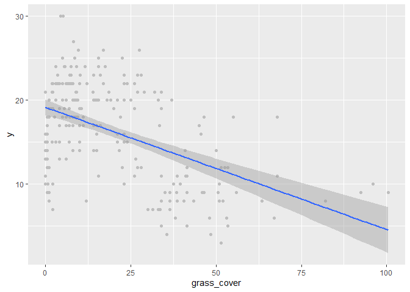<!-- -->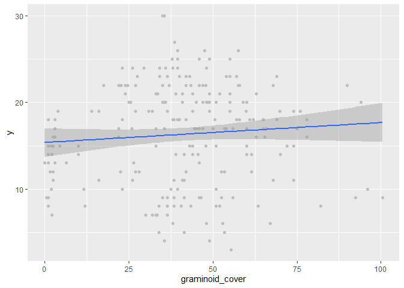<!-- -->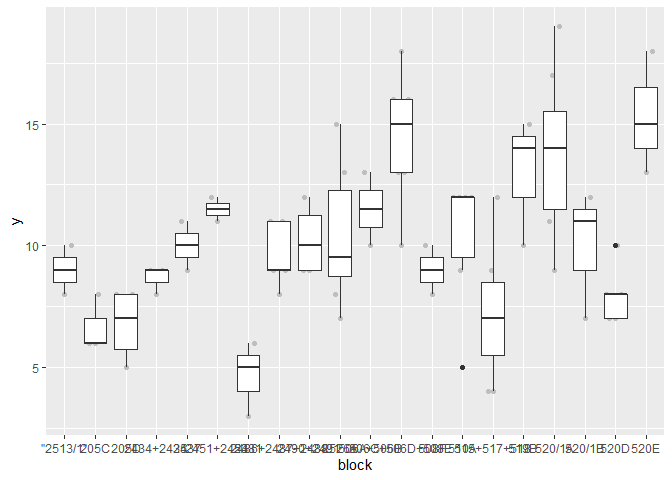<!-- -->

### Outliers, zero-inflation, transformations? (Step 1, 3, 4)

    ## # A tibble: 6 × 2
    ##   treatment           n
    ##   <fct>           <int>
    ## 1 control_2003       42
    ## 2 control_2018       42
    ## 3 control_2021       62
    ## 4 cut_summer         25
    ## 5 cut_autumn         30
    ## 6 topsoil_removal    30

    ## `stat_bin()` using `bins = 30`. Pick better value with `binwidth`.

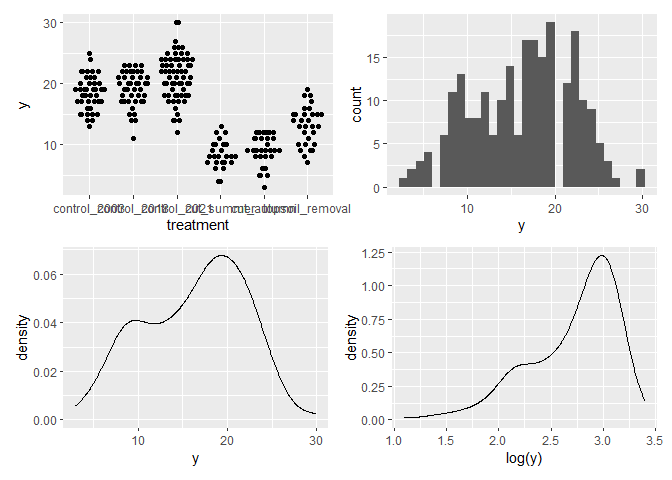<!-- -->

### Check collinearity part 1 (Step 5)

Exclude r \> 0.7 <br> Dormann et al. 2013 Ecography
[DOI:10.1111/j.1600-0587.2012.07348.x](https://doi.org/10.1111/j.1600-0587.2012.07348.x)

``` r
sites %>%
    select(
    cover_vegetation, height_vegetation, grass_cover, graminoid_cover, mem1,
    mem2
    ) %>%
  GGally::ggpairs(lower = list(continuous = "smooth_loess")) +
  theme(strip.text = element_text(size = 7))
```

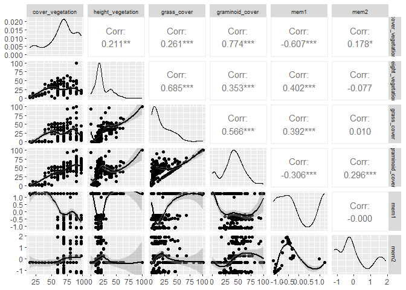<!-- -->

## Models

Only here you have to modify the script to compare other models

``` r
load(file = here("outputs", "models", "model_richness_rlg_2.Rdata"))
load(file = here("outputs", "models", "model_richness_rlg_2sub.Rdata"))
m_1 <- m2
m_2 <- m2sub
```

``` r
m_1
## 
## Call:
## lm(formula = y ~ treatment + year_hay_transfer + mem2, data = sites)
## 
## Coefficients:
##              (Intercept)     treatmentcontrol_2018     treatmentcontrol_2021  
##                  18.5559                    0.6667                    2.6017  
## treatmenttopsoil_removal       treatmentcut_summer       treatmentcut_autumn  
##                  -6.3479                   -9.6556                  -10.1400  
##    year_hay_transfer2003     year_hay_transfer2004     year_hay_transfer2005  
##                   1.5158                    0.5186                    1.2391  
##    year_hay_transfer2006     year_hay_transfer2007     year_hay_transfer2008  
##                  -3.0911                    1.3416                   -1.7143  
##      year_hay_transferno                      mem2  
##                       NA                   -0.3381
m_2
## 
## Call:
## lm(formula = y ~ treatment + year_hay_transfer + mem2, data = subset)
## 
## Coefficients:
##              (Intercept)     treatmentcontrol_2018     treatmentcontrol_2021  
##                  18.5559                    0.6667                    2.6017  
## treatmenttopsoil_removal       treatmentcut_summer       treatmentcut_autumn  
##                  -6.3479                  -11.3698                  -11.8543  
##    year_hay_transfer2003     year_hay_transfer2004     year_hay_transfer2005  
##                   1.5923                    2.2329                    2.9534  
##    year_hay_transfer2006     year_hay_transfer2007     year_hay_transfer2008  
##                  -1.3768                    3.0559                        NA  
##      year_hay_transferno                      mem2  
##                       NA                   -0.3381
```

## Model check

### DHARMa

``` r
simulation_output_1 <- simulateResiduals(m_1, plot = TRUE)
```

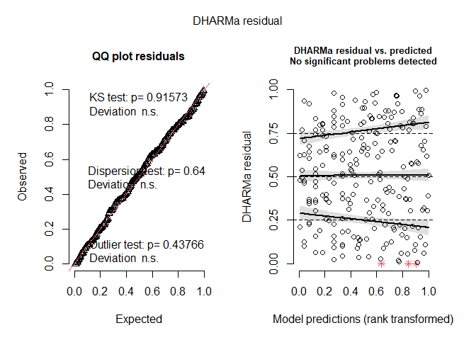<!-- -->

``` r
simulation_output_2 <- simulateResiduals(m_2, plot = TRUE)
```

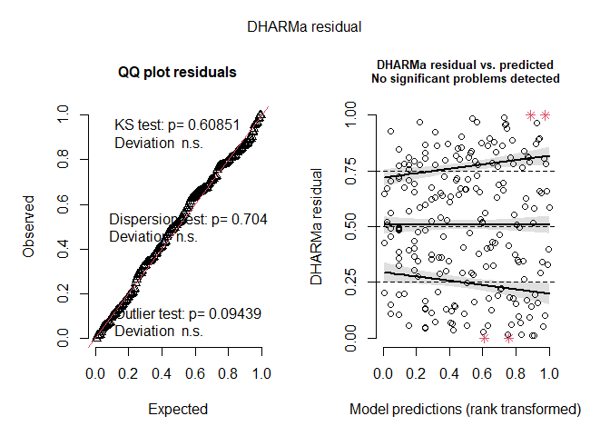<!-- -->

``` r
plotResiduals(simulation_output_1$scaledResiduals, sites$treatment)
```

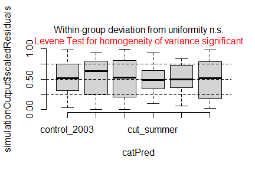<!-- -->

``` r
plotResiduals(simulation_output_2$scaledResiduals, subset$treatment) # dataframe subset
```

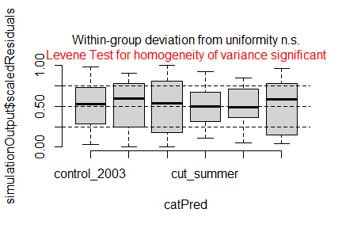<!-- -->

``` r
plotResiduals(simulation_output_1$scaledResiduals, sites$mem2)
```

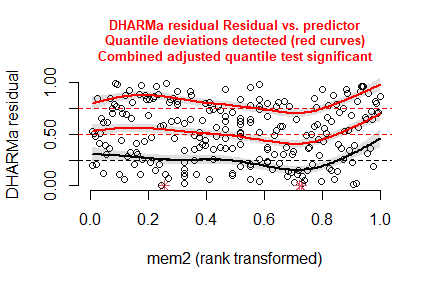<!-- -->

``` r
plotResiduals(simulation_output_2$scaledResiduals, subset$mem2) # dataframe subset
```

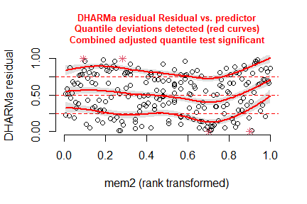<!-- -->

``` r
plotResiduals(simulation_output_1$scaledResiduals, sites$botanist)
```

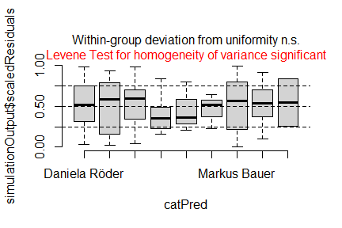<!-- -->

``` r
plotResiduals(simulation_output_2$scaledResiduals, subset$botanist) # dataframe subset
```

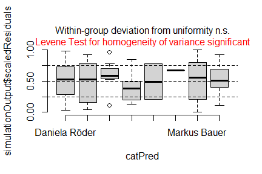<!-- -->

``` r
plotResiduals(simulation_output_1$scaledResiduals, sites$year_hay_transfer)
```

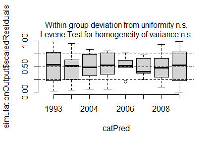<!-- -->

``` r
plotResiduals(simulation_output_2$scaledResiduals, subset$year_hay_transfer) # dataframe subset
```

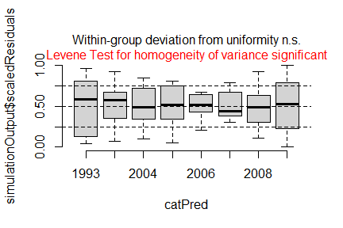<!-- -->

### Check collinearity part 2 (Step 5)

Remove VIF \> 3 or \> 10 <br> Zuur et al. 2010 Methods Ecol Evol
[DOI:10.1111/j.2041-210X.2009.00001.x](https://doi.org/10.1111/j.2041-210X.2009.00001.x)

``` r
#car::vif(m_1)
#car::vif(m_2)
```

## Model comparison

### <i>R</i><sup>2</sup> values

``` r
MuMIn::r.squaredGLMM(m_1)
##            R2m       R2c
## [1,] 0.7271755 0.7271755
MuMIn::r.squaredGLMM(m_2)
##            R2m       R2c
## [1,] 0.7166942 0.7166942
```

### AICc

Use AICc and not AIC since ratio n/K \< 40 <br> Burnahm & Anderson 2002
p. 66 ISBN:
[978-0-387-95364-9](https://search.worldcat.org/de/title/845688581)

``` r
MuMIn::AICc(m_1, m_2) %>%
  arrange(AICc)
##     df     AICc
## m_2 13 1104.173
## m_1 14 1181.981
```

## Predicted values

### Summary table

``` r
summary(m_1)
```

    ## 
    ## Call:
    ## lm(formula = y ~ treatment + year_hay_transfer + mem2, data = sites)
    ## 
    ## Residuals:
    ##     Min      1Q  Median      3Q     Max 
    ## -8.6113 -1.9300  0.0752  2.1597  8.5703 
    ## 
    ## Coefficients: (1 not defined because of singularities)
    ##                          Estimate Std. Error t value Pr(>|t|)    
    ## (Intercept)               18.5559     0.4677  39.674  < 2e-16 ***
    ## treatmentcontrol_2018      0.6667     0.6579   1.013   0.3121    
    ## treatmentcontrol_2021      2.6017     0.6033   4.312 2.45e-05 ***
    ## treatmenttopsoil_removal  -6.3479     0.9630  -6.592 3.23e-10 ***
    ## treatmentcut_summer       -9.6556     1.1127  -8.677 9.49e-16 ***
    ## treatmentcut_autumn      -10.1400     1.6565  -6.122 4.26e-09 ***
    ## year_hay_transfer2003      1.5158     1.1108   1.365   0.1738    
    ## year_hay_transfer2004      0.5186     1.6038   0.323   0.7467    
    ## year_hay_transfer2005      1.2391     1.6300   0.760   0.4480    
    ## year_hay_transfer2006     -3.0911     1.7034  -1.815   0.0709 .  
    ## year_hay_transfer2007      1.3416     1.9530   0.687   0.4928    
    ## year_hay_transfer2008     -1.7143     1.5194  -1.128   0.2605    
    ## year_hay_transferno            NA         NA      NA       NA    
    ## mem2                      -0.3381     0.2040  -1.658   0.0988 .  
    ## ---
    ## Signif. codes:  0 '***' 0.001 '**' 0.01 '*' 0.05 '.' 0.1 ' ' 1
    ## 
    ## Residual standard error: 3.015 on 218 degrees of freedom
    ## Multiple R-squared:  0.7377, Adjusted R-squared:  0.7232 
    ## F-statistic: 51.09 on 12 and 218 DF,  p-value: < 2.2e-16

### Forest plot

``` r
dotwhisker::dwplot(
  list(m_1, m_2),
  ci = 0.95,
  show_intercept = FALSE,
  vline = geom_vline(xintercept = 0, colour = "grey60", linetype = 2)) +
  theme_classic()
```

    ## Model matrix is rank deficient. Parameters `year_hay_transferno` were
    ##   not estimable.

    ## Model matrix is rank deficient. Parameters `year_hay_transfer2008,
    ##   year_hay_transferno` were not estimable.

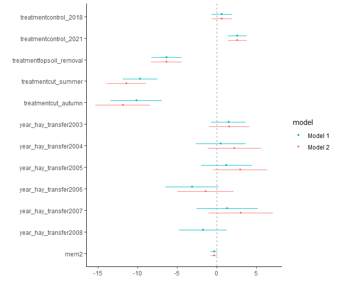<!-- -->

### Effect sizes

Effect sizes of chosen model just to get exact values of means etc. if
necessary.

``` r
(emm <- emmeans(
  m_1,
  revpairwise ~ treatment,
  type = "response"
  ))
```

    ## $emmeans
    ##  treatment       emmean SE df asymp.LCL asymp.UCL
    ##  control_2003    nonEst NA NA        NA        NA
    ##  control_2018    nonEst NA NA        NA        NA
    ##  control_2021    nonEst NA NA        NA        NA
    ##  topsoil_removal nonEst NA NA        NA        NA
    ##  cut_summer      nonEst NA NA        NA        NA
    ##  cut_autumn      nonEst NA NA        NA        NA
    ## 
    ## Results are averaged over the levels of: year_hay_transfer 
    ## Confidence level used: 0.95 
    ## 
    ## $contrasts
    ##  contrast                       estimate    SE  df t.ratio p.value
    ##  control_2018 - control_2003       0.667 0.658 218   1.013  0.7418
    ##  control_2021 - control_2003       2.602 0.603 218   4.312  0.0001
    ##  control_2021 - control_2018       1.935 0.603 218   3.207  0.0083
    ##  topsoil_removal - control_2003   nonEst    NA  NA      NA      NA
    ##  topsoil_removal - control_2018   nonEst    NA  NA      NA      NA
    ##  topsoil_removal - control_2021   nonEst    NA  NA      NA      NA
    ##  cut_summer - control_2003        nonEst    NA  NA      NA      NA
    ##  cut_summer - control_2018        nonEst    NA  NA      NA      NA
    ##  cut_summer - control_2021        nonEst    NA  NA      NA      NA
    ##  cut_summer - topsoil_removal     -3.308 1.310 218  -2.530  0.0581
    ##  cut_autumn - control_2003        nonEst    NA  NA      NA      NA
    ##  cut_autumn - control_2018        nonEst    NA  NA      NA      NA
    ##  cut_autumn - control_2021        nonEst    NA  NA      NA      NA
    ##  cut_autumn - topsoil_removal     -3.792 1.790 218  -2.115  0.1516
    ##  cut_autumn - cut_summer          -0.484 1.230 218  -0.395  0.9791
    ## 
    ## Results are averaged over the levels of: year_hay_transfer 
    ## P value adjustment: tukey method for comparing a family of 4 estimates

``` r
plot(emm, comparison = TRUE)
```

    ## Warning: Removed 6 rows containing missing values or values outside the scale range
    ## (`geom_point()`).

    ## Warning: Removed 6 rows containing missing values or values outside the scale range
    ## (`geom_segment()`).

    ## Warning: Removed 6 rows containing missing values or values outside the scale range
    ## (`geom_point()`).

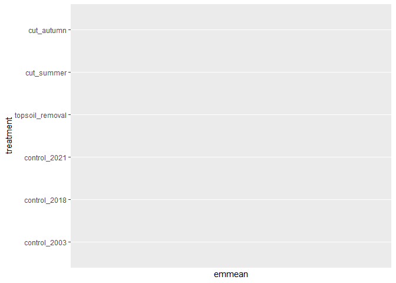<!-- -->

# Session info

    ## R version 4.5.0 (2025-04-11 ucrt)
    ## Platform: x86_64-w64-mingw32/x64
    ## Running under: Windows 11 x64 (build 26100)
    ## 
    ## Matrix products: default
    ##   LAPACK version 3.12.1
    ## 
    ## locale:
    ## [1] LC_COLLATE=German_Germany.utf8  LC_CTYPE=German_Germany.utf8   
    ## [3] LC_MONETARY=German_Germany.utf8 LC_NUMERIC=C                   
    ## [5] LC_TIME=German_Germany.utf8    
    ## 
    ## time zone: America/Denver
    ## tzcode source: internal
    ## 
    ## attached base packages:
    ## [1] stats     graphics  grDevices utils     datasets  methods   base     
    ## 
    ## other attached packages:
    ##  [1] emmeans_1.11.2   DHARMa_0.4.7     patchwork_1.3.1  ggbeeswarm_0.7.2
    ##  [5] lubridate_1.9.4  forcats_1.0.0    stringr_1.5.1    dplyr_1.1.4     
    ##  [9] purrr_1.1.0      readr_2.1.5      tidyr_1.3.1      tibble_3.3.0    
    ## [13] ggplot2_3.5.2    tidyverse_2.0.0  here_1.0.1      
    ## 
    ## loaded via a namespace (and not attached):
    ##  [1] tidyselect_1.2.1       vipor_0.4.7            farver_2.1.2          
    ##  [4] fastmap_1.2.0          GGally_2.2.1           bayestestR_0.16.1     
    ##  [7] promises_1.3.3         digest_0.6.37          estimability_1.5.1    
    ## [10] timechange_0.3.0       mime_0.13              lifecycle_1.0.4       
    ## [13] magrittr_2.0.3         compiler_4.5.0         rlang_1.1.6           
    ## [16] tools_4.5.0            utf8_1.2.6             yaml_2.3.10           
    ## [19] data.table_1.17.8      knitr_1.50             labeling_0.4.3        
    ## [22] bit_4.6.0              ggstance_0.3.7         plyr_1.8.9            
    ## [25] RColorBrewer_1.1-3     gap.datasets_0.0.6     withr_3.0.2           
    ## [28] datawizard_1.1.0       stats4_4.5.0           grid_4.5.0            
    ## [31] xtable_1.8-4           scales_1.4.0           iterators_1.0.14      
    ## [34] MASS_7.3-65            insight_1.3.1          cli_3.6.5             
    ## [37] mvtnorm_1.3-3          dotwhisker_0.8.4       rmarkdown_2.29        
    ## [40] crayon_1.5.3           reformulas_0.4.1       generics_0.1.4        
    ## [43] performance_0.15.0     rstudioapi_0.17.1      tzdb_0.5.0            
    ## [46] parameters_0.27.0      minqa_1.2.8            splines_4.5.0         
    ## [49] parallel_4.5.0         marginaleffects_0.28.0 vctrs_0.6.5           
    ## [52] boot_1.3-31            Matrix_1.7-3           hms_1.1.3             
    ## [55] bit64_4.6.0-1          qgam_2.0.0             beeswarm_0.4.0        
    ## [58] Rmisc_1.5.1            foreach_1.5.2          gap_1.6               
    ## [61] glue_1.8.0             nloptr_2.2.1           ggstats_0.10.0        
    ## [64] codetools_0.2-20       stringi_1.8.7          gtable_0.3.6          
    ## [67] later_1.4.2            lme4_1.1-37            pillar_1.11.0         
    ## [70] htmltools_0.5.8.1      R6_2.6.1               Rdpack_2.6.4          
    ## [73] doParallel_1.0.17      rprojroot_2.1.0        vroom_1.6.5           
    ## [76] evaluate_1.0.4         shiny_1.11.1           lattice_0.22-6        
    ## [79] backports_1.5.0        rbibutils_2.3          httpuv_1.6.16         
    ## [82] Rcpp_1.1.0             gridExtra_2.3          coda_0.19-4.1         
    ## [85] nlme_3.1-168           mgcv_1.9-1             MuMIn_1.48.11         
    ## [88] xfun_0.52              pkgconfig_2.0.3
