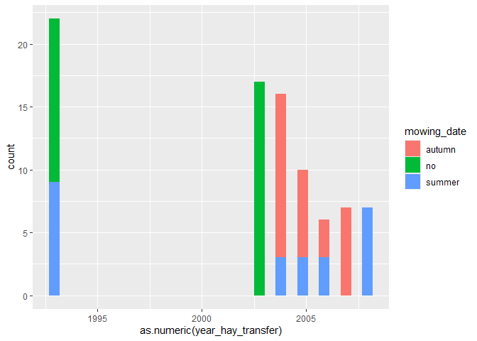
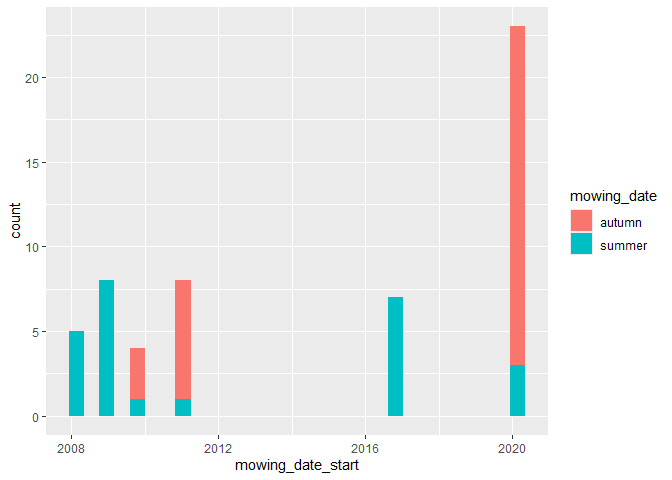
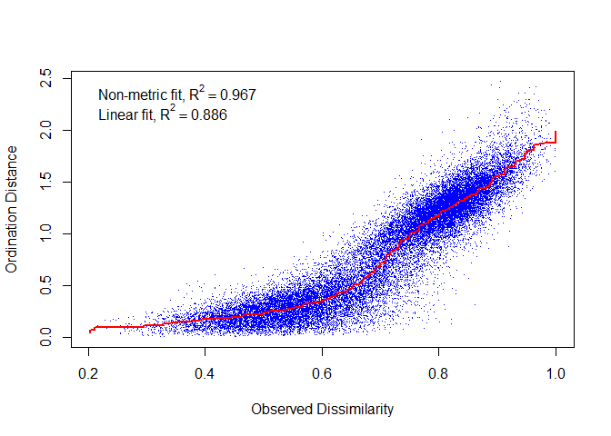
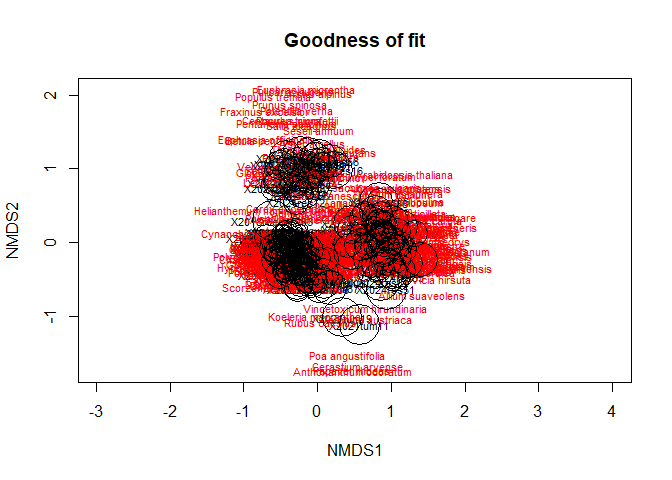
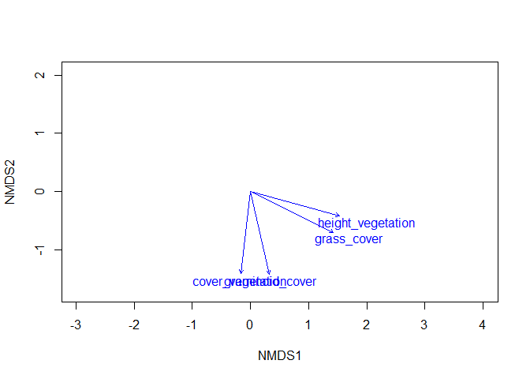
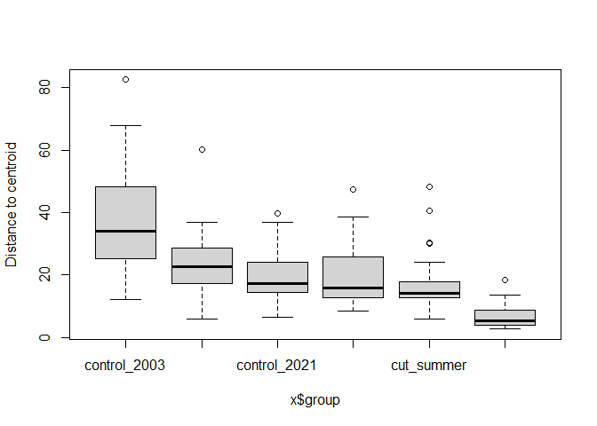
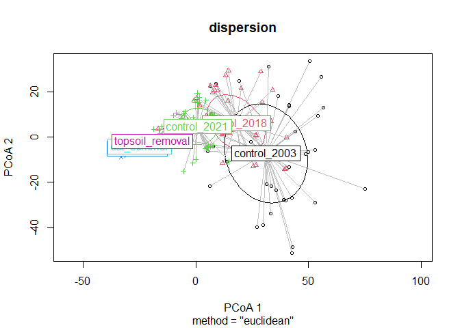

Garchinger Heide and restoration sites: <br> NMDS and PERMANOVA
================
<b>Markus Bauer</b> <br>
<b>2025-07-22</b>

- [Preparation](#preparation)
- [Statistics](#statistics)
  - [Descriptive statistics](#descriptive-statistics)
  - [Models](#models)
  - [Model check](#model-check)
  - [Vectors](#vectors)
  - [Factors](#factors)
- [PERMDISP and PERMANOVA](#permdisp-and-permanova)
  - [PERMDISP](#permdisp)
  - [PERMANOVA](#permanova)
- [Session info](#session-info)

Technichal University of Munich, TUM School of Life Sciences, Chair of
Restoration Ecology, Emil-Ramann-Straße 6, 85354 Freising, Germany

\*<markus1.bauer@tum.de>

ORCiD ID: [0000-0001-5372-4174](https://orcid.org/0000-0001-5372-4174)
<br> [Google
Scholar](https://scholar.google.de/citations?user=oHhmOkkAAAAJ&hl=de&oi=ao)
<br> GitHub: [markus1bauer](https://github.com/markus1bauer) <br>
GitHub:
[TUM-Restoration-Ecology](https://github.com/TUM-Restoration-Ecology)

# Preparation

#### Packages

``` r
library(here)
library(tidyverse)
library(vegan)
```

#### Load data

``` r
sites <- read_csv(
  here("data", "processed", "data_processed_sites.csv"),
  col_names = TRUE, na = c("na", "NA", ""), col_types =
    cols(
    .default = "?"
  )) %>% 
  arrange(id)

species <- read_csv(
  here("data", "processed", "data_processed_species.csv"),
  col_names = TRUE, na = c("na", "NA", ""), col_types = cols(.default = "?")
  ) %>%
  pivot_longer(-accepted_name, names_to = "id", values_to = "value") %>%
  semi_join(sites, by = "id") %>%
  arrange(id) %>%
  pivot_wider(names_from = "accepted_name", values_from = "value") %>%
  column_to_rownames(var = "id")
```

# Statistics

## Descriptive statistics

``` r
sites %>%
  ggplot(aes(x = as.numeric(year_hay_transfer), fill = mowing_date)) +
  geom_histogram()
```

    ## `stat_bin()` using `bins = 30`. Pick better value with `binwidth`.

<!-- -->

``` r
sites %>%
  filter(!(is.na(year_hay_transfer) | year_hay_transfer == "no")) %>%
  ggplot(aes(x = mowing_date_start, fill = mowing_date)) +
  geom_histogram()
```

    ## `stat_bin()` using `bins = 30`. Pick better value with `binwidth`.

<!-- -->

``` r
sites %>%
  group_by(treatment) %>%
  count(esy) %>%
  group_by(treatment) %>%
  mutate(ratio = round(n / sum(n), digits = 2))
```

    ## # A tibble: 17 × 4
    ## # Groups:   treatment [6]
    ##    treatment       esy       n ratio
    ##    <chr>           <chr> <int> <dbl>
    ##  1 control_2003    R        10  0.24
    ##  2 control_2003    R1A      30  0.71
    ##  3 control_2003    R22       2  0.05
    ##  4 control_2018    R         1  0.02
    ##  5 control_2018    R1A      41  0.98
    ##  6 control_2021    R        18  0.29
    ##  7 control_2021    R1A      39  0.63
    ##  8 control_2021    R22       1  0.02
    ##  9 control_2021    S22       4  0.06
    ## 10 cut_autumn      R        14  0.47
    ## 11 cut_autumn      R1A      16  0.53
    ## 12 cut_summer      R        13  0.52
    ## 13 cut_summer      R1A      12  0.48
    ## 14 topsoil_removal H26a      4  0.13
    ## 15 topsoil_removal R         7  0.23
    ## 16 topsoil_removal R1A      18  0.6 
    ## 17 topsoil_removal S22       1  0.03

## Models

``` r
# set.seed(9)
# ordi <- metaMDS(
#   species, dist = "bray", k = 2, engine = "monoMDS", binary = FALSE,
#   try = 99, previous.best = TRUE, na.rm = TRUE
#   )
# save(ordi, file = here("outputs", "models", "model_nmds.Rdata"))
base::load(here("outputs", "models", "model_nmds.Rdata"))
```

``` r
ordi
## 
## Call:
## metaMDS(comm = species, distance = "bray", k = 2, try = 99, engine = "monoMDS",      previous.best = TRUE, binary = FALSE, na.rm = TRUE) 
## 
## global Multidimensional Scaling using monoMDS
## 
## Data:     wisconsin(sqrt(species)) 
## Distance: bray 
## 
## Dimensions: 2 
## Stress:     0.1803642 
## Stress type 1, weak ties
## Best solution was not repeated after 20 tries
## The best solution was from try 12 (random start)
## Scaling: centring, PC rotation, halfchange scaling 
## Species: expanded scores based on 'wisconsin(sqrt(species))'
```

## Model check

``` r
stressplot(ordi)
```

<!-- -->

``` r
goodness_of_fit <- goodness(ordi)
plot(ordi, type = "t", main = "Goodness of fit")
points(ordi, display = "sites", cex = goodness_of_fit * 300)
```

<!-- -->

## Vectors

``` r
ef_vector1 <- envfit(
  ordi ~ height_vegetation + cover_vegetation + grass_cover + graminoid_cover,
  data = sites,
  permu = 999,
  na.rm = TRUE
)
ef_vector1
## 
## ***VECTORS
## 
##                      NMDS1    NMDS2     r2 Pr(>r)    
## height_vegetation  0.96483 -0.26286 0.6537  0.001 ***
## cover_vegetation  -0.11301 -0.99359 0.5233  0.001 ***
## grass_cover        0.89626 -0.44352 0.6601  0.001 ***
## graminoid_cover    0.22117 -0.97524 0.5526  0.001 ***
## ---
## Signif. codes:  0 '***' 0.001 '**' 0.01 '*' 0.05 '.' 0.1 ' ' 1
## Permutation: free
## Number of permutations: 999
## 
## 42 Beobachtungen als fehlend gelöscht
plot(ordi, type = "n")
plot(ef_vector1, add = TRUE, p. = .99)
```

<!-- -->

``` r
# save(ef_vector1, file = here("outputs", "models", "model_nmds_envfit_vector1.Rdata"))
```

## Factors

``` r
ef_factor1 <- envfit(
  ordi ~  treatment,
  data = sites, permu = 999, na.rm = TRUE
)
ef_factor1
## 
## ***FACTORS:
## 
## Centroids:
##                            NMDS1   NMDS2
## treatmentcontrol_2003    -0.3982 -0.0375
## treatmentcontrol_2018    -0.2760 -0.1674
## treatmentcontrol_2021    -0.2250 -0.3355
## treatmentcut_autumn       0.9103  0.1095
## treatmentcut_summer       0.8347 -0.0932
## treatmenttopsoil_removal -0.1971  0.9484
## 
## Goodness of fit:
##               r2 Pr(>r)    
## treatment 0.8518  0.001 ***
## ---
## Signif. codes:  0 '***' 0.001 '**' 0.01 '*' 0.05 '.' 0.1 ' ' 1
## Permutation: free
## Number of permutations: 999
```

# PERMDISP and PERMANOVA

## PERMDISP

``` r
dispersion <- betadisper(dist(species), sites$treatment)
permutest(dispersion)
```

    ## 
    ## Permutation test for homogeneity of multivariate dispersions
    ## Permutation: free
    ## Number of permutations: 999
    ## 
    ## Response: Distances
    ##            Df Sum Sq Mean Sq      F N.Perm Pr(>F)    
    ## Groups      5  18109  3621.7 32.802    999  0.001 ***
    ## Residuals 225  24843   110.4                         
    ## ---
    ## Signif. codes:  0 '***' 0.001 '**' 0.01 '*' 0.05 '.' 0.1 ' ' 1

``` r
boxplot(dispersion)
```

<!-- -->

``` r
TukeyHSD(dispersion)
```

    ##   Tukey multiple comparisons of means
    ##     95% family-wise confidence level
    ## 
    ## Fit: aov(formula = distances ~ group, data = df)
    ## 
    ## $group
    ##                                     diff        lwr        upr     p adj
    ## control_2018-control_2003    -14.4923446 -21.083359  -7.901330 0.0000000
    ## control_2021-control_2003    -17.6144385 -23.650562 -11.578315 0.0000000
    ## cut_autumn-control_2003      -18.0459377 -25.266033 -10.825843 0.0000000
    ## cut_summer-control_2003      -19.7428650 -27.372516 -12.113214 0.0000000
    ## topsoil_removal-control_2003 -30.8646093 -38.084704 -23.644514 0.0000000
    ## control_2021-control_2018     -3.1220940  -9.158217   2.914029 0.6730996
    ## cut_autumn-control_2018       -3.5535932 -10.773688   3.666502 0.7180801
    ## cut_summer-control_2018       -5.2505204 -12.880171   2.379131 0.3581702
    ## topsoil_removal-control_2018 -16.3722647 -23.592360  -9.152170 0.0000000
    ## cut_autumn-control_2021       -0.4314992  -7.148871   6.285872 0.9999700
    ## cut_summer-control_2021       -2.1284264  -9.284185   5.027333 0.9565594
    ## topsoil_removal-control_2021 -13.2501708 -19.967542  -6.532799 0.0000006
    ## cut_summer-cut_autumn         -1.6969272  -9.876161   6.482307 0.9912018
    ## topsoil_removal-cut_autumn   -12.8186716 -20.617265  -5.020078 0.0000592
    ## topsoil_removal-cut_summer   -11.1217444 -19.300979  -2.942510 0.0016955

``` r
plot(dispersion, hull = FALSE, ellipse = TRUE, label = TRUE)
```

<!-- -->

## PERMANOVA

Exclude reference sites (control) from 2003 because of high dispersion
within this group

``` r
data <- species %>%
  rownames_to_column(var = "id") %>%
  filter(!(str_detect(id, "2003roeder")))
sites2 <- sites %>%
  semi_join(data, by = "id")
species2 <- data %>%
  column_to_rownames(var = "id")

(permanova <- adonis2(
  species2 ~ treatment, data = sites2,
  permutations = 999,
  method = "bray")
)
```

    ## Permutation test for adonis under reduced model
    ## Permutation: free
    ## Number of permutations: 999
    ## 
    ## adonis2(formula = species2 ~ treatment, data = sites2, permutations = 999, method = "bray")
    ##           Df SumOfSqs      R2      F Pr(>F)    
    ## Model      4   27.248 0.51026 47.927  0.001 ***
    ## Residual 184   26.152 0.48974                  
    ## Total    188   53.400 1.00000                  
    ## ---
    ## Signif. codes:  0 '***' 0.001 '**' 0.01 '*' 0.05 '.' 0.1 ' ' 1

# Session info

    ## R version 4.5.0 (2025-04-11 ucrt)
    ## Platform: x86_64-w64-mingw32/x64
    ## Running under: Windows 11 x64 (build 26100)
    ## 
    ## Matrix products: default
    ##   LAPACK version 3.12.1
    ## 
    ## locale:
    ## [1] LC_COLLATE=German_Germany.utf8  LC_CTYPE=German_Germany.utf8   
    ## [3] LC_MONETARY=German_Germany.utf8 LC_NUMERIC=C                   
    ## [5] LC_TIME=German_Germany.utf8    
    ## 
    ## time zone: America/New_York
    ## tzcode source: internal
    ## 
    ## attached base packages:
    ## [1] stats     graphics  grDevices utils     datasets  methods   base     
    ## 
    ## other attached packages:
    ##  [1] vegan_2.7-1     permute_0.9-8   lubridate_1.9.4 forcats_1.0.0  
    ##  [5] stringr_1.5.1   dplyr_1.1.4     purrr_1.1.0     readr_2.1.5    
    ##  [9] tidyr_1.3.1     tibble_3.3.0    ggplot2_3.5.2   tidyverse_2.0.0
    ## [13] here_1.0.1     
    ## 
    ## loaded via a namespace (and not attached):
    ##  [1] utf8_1.2.6         generics_0.1.4     stringi_1.8.7      lattice_0.22-6    
    ##  [5] hms_1.1.3          digest_0.6.37      magrittr_2.0.3     evaluate_1.0.4    
    ##  [9] grid_4.5.0         timechange_0.3.0   RColorBrewer_1.1-3 fastmap_1.2.0     
    ## [13] rprojroot_2.1.0    Matrix_1.7-3       mgcv_1.9-1         scales_1.4.0      
    ## [17] cli_3.6.5          crayon_1.5.3       rlang_1.1.6        bit64_4.6.0-1     
    ## [21] splines_4.5.0      withr_3.0.2        yaml_2.3.10        tools_4.5.0       
    ## [25] parallel_4.5.0     tzdb_0.5.0         vctrs_0.6.5        R6_2.6.1          
    ## [29] lifecycle_1.0.4    bit_4.6.0          vroom_1.6.5        MASS_7.3-65       
    ## [33] cluster_2.1.8.1    pkgconfig_2.0.3    pillar_1.11.0      gtable_0.3.6      
    ## [37] glue_1.8.0         xfun_0.52          tidyselect_1.2.1   rstudioapi_0.17.1 
    ## [41] knitr_1.50         farver_2.1.2       htmltools_0.5.8.1  nlme_3.1-168      
    ## [45] labeling_0.4.3     rmarkdown_2.29     compiler_4.5.0
