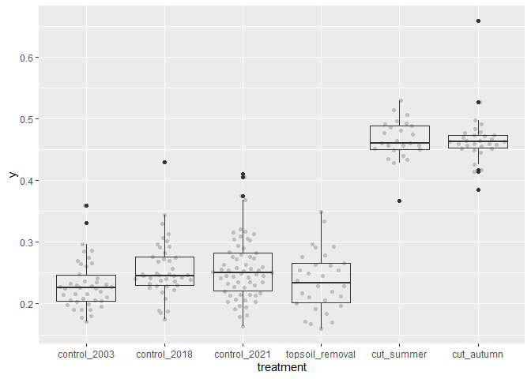
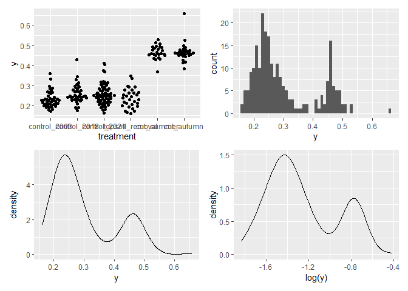

Garchinger Heide and restoration sites: <br> Plant height
================
<b>Markus Bauer</b> <br>
<b>2025-08-04</b>

- [Preparation](#preparation)
- [Statistics](#statistics)
  - [Data exploration](#data-exploration)
    - [Means and deviations](#means-and-deviations)
    - [Graphs of raw data](#graphs-of-raw-data)
    - [Outliers, zero-inflation,
      transformations?](#outliers-zero-inflation-transformations)
  - [Model](#model)
- [Subset of dataset](#subset-of-dataset)
  - [Set up data](#set-up-data)
  - [Model of subset](#model-of-subset)
- [Session info](#session-info)

<br/> <br/> <b>Markus Bauer</b>\*, <b>Sina Appeltauer</b>, <b>Malte
Knöppler</b>, <b>Maren Teschauer</b> & <b>Johannes Kollmann</b>

Technichal University of Munich, TUM School of Life Sciences, Chair of
Restoration Ecology, Emil-Ramann-Straße 6, 85354 Freising, Germany

\*<markus1.bauer@tum.de>

ORCiD ID: [0000-0001-5372-4174](https://orcid.org/0000-0001-5372-4174)
<br> [Google
Scholar](https://scholar.google.de/citations?user=oHhmOkkAAAAJ&hl=de&oi=ao)
<br> GitHub: [markus1bauer](https://github.com/markus1bauer) <br>
GitHub:
[TUM-Restoration-Ecology](https://github.com/TUM-Restoration-Ecology)

# Preparation

#### Packages

``` r
library(here)
library(tidyverse)
library(ggbeeswarm)
library(patchwork)
library(ade4)
```

#### Load data

``` r
sites <- read_csv(
  here("data", "processed", "data_processed_sites.csv"),
  col_names = TRUE, na = c("na", "NA", ""), col_types =
    cols(
      .default = "?",
      treatment = "f"
    )
) %>%
  rename(y = CWM_Height)

sites_fc <- sites %>%
  select(
    id, treatment, grass_cover, graminoid_cover
  ) %>% 
  column_to_rownames(var = "id")

traits <- read_csv(
  here("data", "processed", "data_processed_traits.csv"),
  col_names = TRUE, na = c("na", "NA", ""), col_types =
    cols(
      .default = "?"
    )
) %>%
  mutate(log_y = log(height)) %>%
  column_to_rownames(var = "accepted_name") %>% 
  select(log_y) %>%
  drop_na() %>%
  rownames_to_column(var = "accepted_name")

species <- read_csv(
  here("data", "processed", "data_processed_species.csv"),
  col_names = TRUE, na = c("na", "NA", ""), col_types =
    cols(
      .default = "?"
    )
) %>%
  semi_join(traits, by = "accepted_name") %>%
  pivot_longer(-accepted_name, names_to = "id_plot", values_to = "cover") %>%
  pivot_wider(names_from = "accepted_name", values_from = "cover") %>%
  column_to_rownames(var = "id_plot")

traits <- traits %>%
  column_to_rownames(var = "accepted_name")
```

# Statistics

## Data exploration

### Means and deviations

``` r
Rmisc::CI(sites$y, ci = .95)
```

    ##     upper      mean     lower 
    ## 0.3128474 0.2993275 0.2858075

``` r
median(sites$y)
```

    ## [1] 0.2568093

``` r
sd(sites$y)
```

    ## [1] 0.1042898

``` r
quantile(sites$y, probs = c(0.05, 0.95), na.rm = TRUE)
```

    ##        5%       95% 
    ## 0.1845692 0.4843522

### Graphs of raw data

<!-- -->

### Outliers, zero-inflation, transformations?

    ## # A tibble: 6 × 2
    ## # Groups:   treatment [6]
    ##   treatment           n
    ##   <fct>           <int>
    ## 1 control_2003       42
    ## 2 control_2018       42
    ## 3 control_2021       62
    ## 4 topsoil_removal    30
    ## 5 cut_summer         25
    ## 6 cut_autumn         30

<!-- -->

## Model

``` r
m <- ade4::fourthcorner(
  tabR = sites_fc, tabL = species, tabQ = traits, modeltype = 6,
  nrepet = 999
)
```

``` r
summary(m)
## Fourth-corner Statistics
## ------------------------
## Permutation method  Comb. 2 and 4  ( 999  permutations)
## 
## Adjustment method for multiple comparisons:   holm 
##                      Test Stat          Obs   Std.Obs     Alter Pvalue
## 1       treatment / log_y    F 914.77964906 4.4683735   greater  0.005
## 2     grass_cover / log_y    r   0.38685726 2.5154245 two-sided  0.003
## 3 graminoid_cover / log_y    r   0.02466519 0.5252431 two-sided  0.629
##   Pvalue.adj   
## 1      0.010 **
## 2      0.009 **
## 3      0.629   
## 
## ---
## Signif. codes:  0 '***' 0.001 '**' 0.01 '*' 0.05 '.' 0.1 ' ' 1
m
## Fourth-corner Statistics
## ------------------------
## Permutation method  Comb. 2 and 4  ( 999  permutations)
## 
## Adjustment method for multiple comparisons:   holm 
## call:  ade4::fourthcorner(tabR = sites_fc, tabL = species, tabQ = traits,      modeltype = 6, nrepet = 999) 
## 
## ---
## 
##                            Test   Stat        Obs    Std.Obs     Alter Pvalue
## 1    treat.control_2003 / log_y Homog. 0.28658327  5.3601379      less      1
## 2    treat.control_2018 / log_y Homog. 0.20643636  1.3821120      less  0.898
## 3    treat.control_2021 / log_y Homog. 0.22667209 -0.2305029      less  0.434
## 4 treat.topsoil_removal / log_y Homog. 0.03822266 -0.2711166      less  0.507
## 5      treat.cut_summer / log_y Homog. 0.02769074 -1.2476593      less  0.094
## 6      treat.cut_autumn / log_y Homog. 0.02816805 -1.3673402      less  0.049
## 7           grass_cover / log_y      r 0.38685726  2.5154245 two-sided  0.003
## 8       graminoid_cover / log_y      r 0.02466519  0.7399019 two-sided   0.48
##   Pvalue.adj  
## 1          1  
## 2          1  
## 3          1  
## 4          1  
## 5      0.564  
## 6      0.343  
## 7      0.024 *
## 8          1  
## 
## ---
## Signif. codes:  0 '***' 0.001 '**' 0.01 '*' 0.05 '.' 0.1 ' ' 1
```

# Subset of dataset

## Set up data

``` r
subset_sites <- sites %>%
  mutate(
    hay_and_mowing_date = str_c(
      year_hay_transfer, mowing_date, sep = "_"
    )
  ) %>%
  filter(
    is.na(hay_and_mowing_date) | !(hay_and_mowing_date %in% c("1993_summer")),
    is.na(year_topsoil_removal) | year_topsoil_removal != "1996/2003"
  )

subset_sites_fc <- subset_sites %>%
  select(
    id, treatment, grass_cover, graminoid_cover
  ) %>% 
  column_to_rownames(var = "id")

subset_species <- species %>%
  rownames_to_column(var = "id") %>%
  pivot_longer(-id, names_to = "accepted_name", values_to = "cover") %>%
  semi_join(subset_sites, by = "id") %>% 
  pivot_wider(names_from = "accepted_name", values_from = "cover") %>%
  column_to_rownames(var = "id")
```

## Model of subset

``` r
m_sub <- ade4::fourthcorner(
  tabR = subset_sites_fc, tabL = subset_species, tabQ = traits, modeltype = 6,
  nrepet = 999
)
```

``` r
summary(m_sub)
## Fourth-corner Statistics
## ------------------------
## Permutation method  Comb. 2 and 4  ( 999  permutations)
## 
## Adjustment method for multiple comparisons:   holm 
##                      Test Stat          Obs   Std.Obs     Alter Pvalue
## 1       treatment / log_y    F 807.31547293 4.5733076   greater  0.005
## 2     grass_cover / log_y    r   0.38985888 2.5640644 two-sided  0.002
## 3 graminoid_cover / log_y    r   0.02193272 0.4938806 two-sided  0.658
##   Pvalue.adj   
## 1      0.010 **
## 2      0.006 **
## 3      0.658   
## 
## ---
## Signif. codes:  0 '***' 0.001 '**' 0.01 '*' 0.05 '.' 0.1 ' ' 1
m_sub
## Fourth-corner Statistics
## ------------------------
## Permutation method  Comb. 2 and 4  ( 999  permutations)
## 
## Adjustment method for multiple comparisons:   holm 
## call:  ade4::fourthcorner(tabR = subset_sites_fc, tabL = subset_species,      tabQ = traits, modeltype = 6, nrepet = 999) 
## 
## ---
## 
##                            Test   Stat        Obs    Std.Obs     Alter Pvalue
## 1    treat.control_2003 / log_y Homog. 0.29906062  4.9571384      less      1
## 2    treat.control_2018 / log_y Homog. 0.21542425  0.9750581      less  0.832
## 3    treat.control_2021 / log_y Homog. 0.23654101 -0.2937049      less  0.405
## 4 treat.topsoil_removal / log_y Homog. 0.03192715 -0.2441495      less  0.536
## 5      treat.cut_summer / log_y Homog. 0.01334038 -1.2534592      less  0.062
## 6      treat.cut_autumn / log_y Homog. 0.02939444 -1.4342456      less  0.041
## 7           grass_cover / log_y      r 0.38985888  2.5640644 two-sided  0.002
## 8       graminoid_cover / log_y      r 0.02193272  0.6569129 two-sided  0.522
##   Pvalue.adj  
## 1          1  
## 2          1  
## 3          1  
## 4          1  
## 5      0.372  
## 6      0.287  
## 7      0.016 *
## 8          1  
## 
## ---
## Signif. codes:  0 '***' 0.001 '**' 0.01 '*' 0.05 '.' 0.1 ' ' 1
```

# Session info

    ## R version 4.5.0 (2025-04-11 ucrt)
    ## Platform: x86_64-w64-mingw32/x64
    ## Running under: Windows 11 x64 (build 26100)
    ## 
    ## Matrix products: default
    ##   LAPACK version 3.12.1
    ## 
    ## locale:
    ## [1] LC_COLLATE=German_Germany.utf8  LC_CTYPE=German_Germany.utf8   
    ## [3] LC_MONETARY=German_Germany.utf8 LC_NUMERIC=C                   
    ## [5] LC_TIME=German_Germany.utf8    
    ## 
    ## time zone: America/Denver
    ## tzcode source: internal
    ## 
    ## attached base packages:
    ## [1] stats     graphics  grDevices utils     datasets  methods   base     
    ## 
    ## other attached packages:
    ##  [1] ade4_1.7-23      patchwork_1.3.1  ggbeeswarm_0.7.2 lubridate_1.9.4 
    ##  [5] forcats_1.0.0    stringr_1.5.1    dplyr_1.1.4      purrr_1.1.0     
    ##  [9] readr_2.1.5      tidyr_1.3.1      tibble_3.3.0     ggplot2_3.5.2   
    ## [13] tidyverse_2.0.0  here_1.0.1      
    ## 
    ## loaded via a namespace (and not attached):
    ##  [1] Rmisc_1.5.1        utf8_1.2.6         generics_0.1.4     lattice_0.22-6    
    ##  [5] stringi_1.8.7      hms_1.1.3          digest_0.6.37      magrittr_2.0.3    
    ##  [9] evaluate_1.0.4     grid_4.5.0         timechange_0.3.0   RColorBrewer_1.1-3
    ## [13] fastmap_1.2.0      plyr_1.8.9         rprojroot_2.1.0    scales_1.4.0      
    ## [17] cli_3.6.5          rlang_1.1.6        crayon_1.5.3       bit64_4.6.0-1     
    ## [21] withr_3.0.2        yaml_2.3.10        parallel_4.5.0     tools_4.5.0       
    ## [25] tzdb_0.5.0         vctrs_0.6.5        R6_2.6.1           lifecycle_1.0.4   
    ## [29] bit_4.6.0          vipor_0.4.7        vroom_1.6.5        MASS_7.3-65       
    ## [33] pkgconfig_2.0.3    beeswarm_0.4.0     pillar_1.11.0      gtable_0.3.6      
    ## [37] glue_1.8.0         Rcpp_1.1.0         xfun_0.52          tidyselect_1.2.1  
    ## [41] rstudioapi_0.17.1  knitr_1.50         farver_2.1.2       htmltools_0.5.8.1 
    ## [45] labeling_0.4.3     rmarkdown_2.29     compiler_4.5.0
