Garchinger Heide and restoration sites: <br> R1A indicator richness
================
<b>Sina Appeltauer, Markus Bauer</b> <br>
<b>2025-07-16</b>

- [Preparation](#preparation)
- [Statistics](#statistics)
  - [Data exploration](#data-exploration)
    - [Means and deviations](#means-and-deviations)
    - [Graphs of raw data (Step 2, 6,
      7)](#graphs-of-raw-data-step-2-6-7)
    - [Outliers, zero-inflation, transformations? (Step 1, 3,
      4)](#outliers-zero-inflation-transformations-step-1-3-4)
    - [Check collinearity part 1 (Step
      5)](#check-collinearity-part-1-step-5)
  - [Models](#models)
  - [Model check](#model-check)
    - [DHARMa](#dharma)
    - [Check collinearity part 2 (Step
      5)](#check-collinearity-part-2-step-5)
  - [Model comparison](#model-comparison)
    - [<i>R</i><sup>2</sup> values](#r2-values)
    - [AICc](#aicc)
  - [Predicted values](#predicted-values)
    - [Summary table](#summary-table)
    - [Forest plot](#forest-plot)
    - [Effect sizes](#effect-sizes)
- [Session info](#session-info)

<br/> <br/> <b>Sina Appeltauer</b>, <b>Malte Knöppler</b>, <b>Maren
Teschauer</b> & <b>Markus Bauer</b>\*

Technichal University of Munich, TUM School of Life Sciences, Chair of
Restoration Ecology, Emil-Ramann-Straße 6, 85354 Freising, Germany

\*<markus1.bauer@tum.de>

ORCiD ID: [0000-0001-5372-4174](https://orcid.org/0000-0001-5372-4174)
<br> [Google
Scholar](https://scholar.google.de/citations?user=oHhmOkkAAAAJ&hl=de&oi=ao)
<br> GitHub: [markus1bauer](https://github.com/markus1bauer) <br>
GitHub:
[TUM-Restoration-Ecology](https://github.com/TUM-Restoration-Ecology)

To compare different models, you only have to change the models in
section ‘Load models’

# Preparation

Protocol of data exploration (Steps 1-8) used from Zuur et al. (2010)
Methods Ecol Evol
[DOI:10.1111/2041-210X.12577](https://doi.org/10.1111/2041-210X.12577)

#### Packages

``` r
library(here)
library(tidyverse)
library(ggbeeswarm)
library(patchwork)
library(DHARMa)
library(emmeans)
```

#### Load data

``` r
sites <- read_csv(
  here("data", "processed", "data_processed_sites.csv"),
  col_names = TRUE, na = c("", "na", "NA"), col_types = 
    cols(
      .default = "?",
      treatment = col_factor(
        levels = c("control_2003", "control_2018", "control_2021", "cut_summer",
                   "cut_autumn", "grazing")
      )
    )
  ) %>%
  rename(y = richness_R1A)
```

# Statistics

## Data exploration

### Means and deviations

``` r
Rmisc::CI(sites$y, ci = .95)
```

    ##    upper     mean    lower 
    ## 16.59736 15.96186 15.32637

``` r
median(sites$y)
```

    ## [1] 16

``` r
sd(sites$y)
```

    ## [1] 4.9554

``` r
quantile(sites$y, probs = c(0.05, 0.95), na.rm = TRUE)
```

    ##  5% 95% 
    ##   7  24

### Graphs of raw data (Step 2, 6, 7)

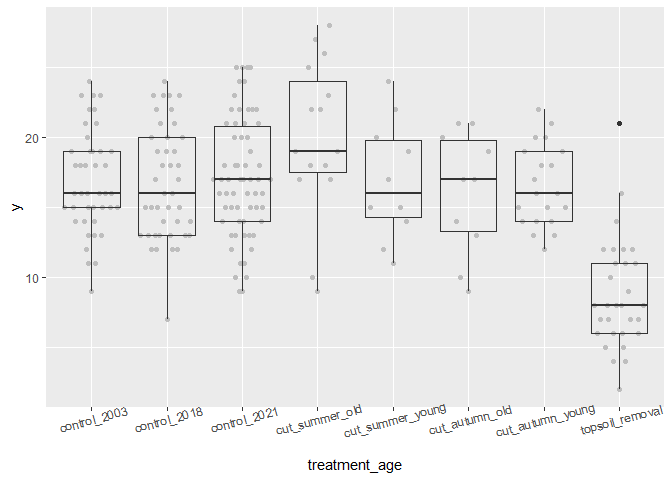<!-- -->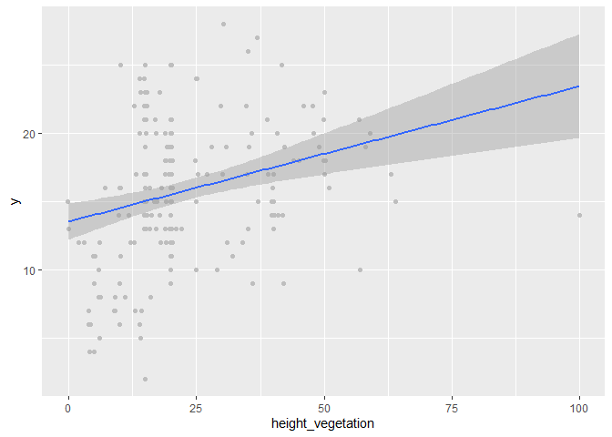<!-- -->

### Outliers, zero-inflation, transformations? (Step 1, 3, 4)

    ## # A tibble: 6 × 2
    ##   treatment        n
    ##   <fct>        <int>
    ## 1 control_2003    42
    ## 2 control_2018    42
    ## 3 control_2021    62
    ## 4 cut_summer      30
    ## 5 cut_autumn      30
    ## 6 grazing         30

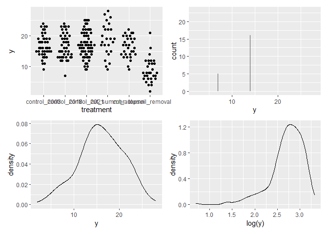<!-- -->

### Check collinearity part 1 (Step 5)

Exclude r \> 0.7 <br> Dormann et al. 2013 Ecography
[DOI:10.1111/j.1600-0587.2012.07348.x](https://doi.org/10.1111/j.1600-0587.2012.07348.x)

``` r
sites %>%
  select(height_vegetation, cover_vegetation) %>%
  GGally::ggpairs(lower = list(continuous = "smooth_loess")) +
  theme(strip.text = element_text(size = 7))
```

<!-- -->

## Models

Only here you have to modify the script to compare other models

``` r
load(file = here("outputs", "models", "model_richness_r1a_1.Rdata"))
load(file = here("outputs", "models", "model_richness_r1a_2.Rdata"))
m_1 <- m1
m_2 <- m2
```

``` r
m_1
## 
## Call:
## lm(formula = y ~ treatment, data = sites)
## 
## Coefficients:
##           (Intercept)  treatmentcontrol_2018  treatmentcontrol_2021  
##               16.8810                -0.1667                 0.2320  
##      treatmentgrazing    treatmentcut_summer    treatmentcut_autumn  
##               -8.1143                 1.1190                -0.4810
m_2
## 
## Call:
## lm(formula = y ~ treatment + mem2, data = sites)
## 
## Coefficients:
##           (Intercept)  treatmentcontrol_2018  treatmentcontrol_2021  
##               17.0497                -0.1667                 0.1190  
##      treatmentgrazing    treatmentcut_summer    treatmentcut_autumn  
##               -8.4790                 0.7543                -0.8457  
##                  mem2  
##               -0.7413
```

## Model check

### DHARMa

``` r
simulation_output_1 <- simulateResiduals(m_1, plot = TRUE)
```

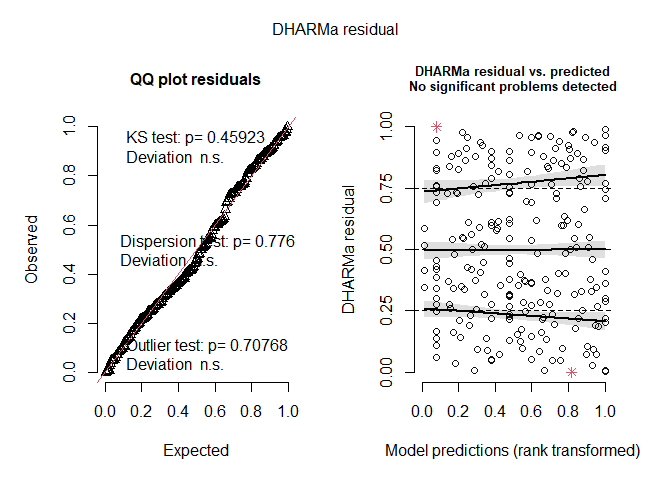<!-- -->

``` r
simulation_output_2 <- simulateResiduals(m_2, plot = TRUE)
```

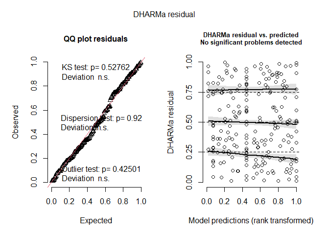<!-- -->

``` r
plotResiduals(simulation_output_1$scaledResiduals, sites$treatment)
```

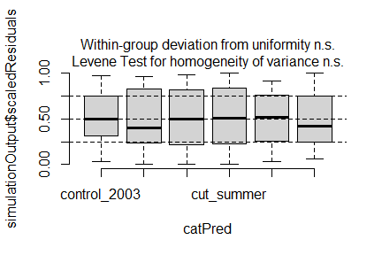<!-- -->

``` r
plotResiduals(simulation_output_2$scaledResiduals, sites$treatment)
```

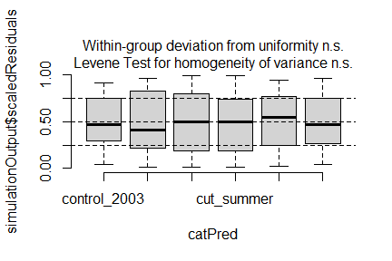<!-- -->

``` r
plotResiduals(simulation_output_1$scaledResiduals, sites$mem2)
```

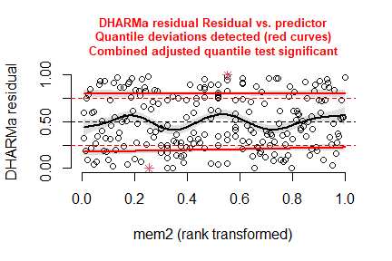<!-- -->

``` r
plotResiduals(simulation_output_2$scaledResiduals, sites$mem2)
```

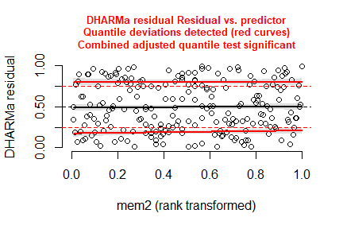<!-- -->

``` r
plotResiduals(simulation_output_1$scaledResiduals, sites$cover_vegetation)
```

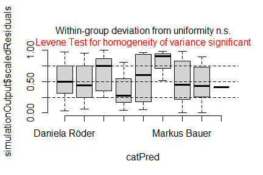<!-- -->

``` r
plotResiduals(simulation_output_2$scaledResiduals, sites$cover_vegetation)
```

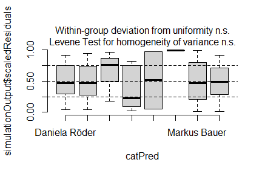<!-- -->

``` r
plotResiduals(simulation_output_1$scaledResiduals, sites$height_vegetation)
```

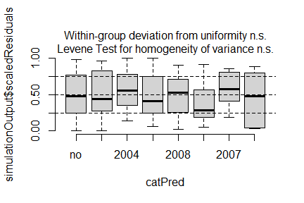<!-- -->

``` r
plotResiduals(simulation_output_2$scaledResiduals, sites$height_vegetation)
```

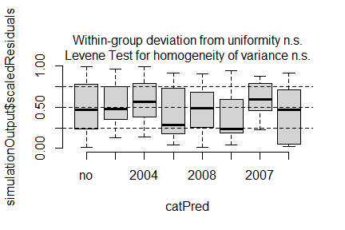<!-- -->

``` r
plotResiduals(simulation_output_1$scaledResiduals, sites$botanist)
```

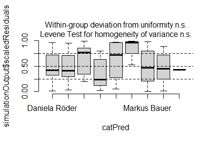<!-- -->

``` r
plotResiduals(simulation_output_2$scaledResiduals, sites$botanist)
```

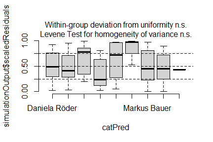<!-- -->

### Check collinearity part 2 (Step 5)

Remove VIF \> 3 or \> 10 <br> Zuur et al. 2010 Methods Ecol Evol
[DOI:10.1111/j.2041-210X.2009.00001.x](https://doi.org/10.1111/j.2041-210X.2009.00001.x)

``` r
#car::vif(m_1)
car::vif(m_2)
```

    ##              GVIF Df GVIF^(1/(2*Df))
    ## treatment 1.04887  5        1.004783
    ## mem2      1.04887  1        1.024143

## Model comparison

### <i>R</i><sup>2</sup> values

``` r
MuMIn::r.squaredGLMM(m_1)
##            R2m       R2c
## [1,] 0.3116067 0.3116067
MuMIn::r.squaredGLMM(m_2)
##            R2m       R2c
## [1,] 0.3319049 0.3319049
```

### AICc

Use AICc and not AIC since ratio n/K \< 40 <br> Burnahm & Anderson 2002
p. 66 ISBN:
[978-0-387-95364-9](https://search.worldcat.org/de/title/845688581)

``` r
MuMIn::AICc(m_1, m_2) %>%
  arrange(AICc)
##     df     AICc
## m_2  8 1343.569
## m_1  7 1348.939
```

## Predicted values

### Summary table

``` r
summary(m_2)
```

    ## 
    ## Call:
    ## lm(formula = y ~ treatment + mem2, data = sites)
    ## 
    ## Residuals:
    ##     Min      1Q  Median      3Q     Max 
    ## -9.0000 -2.7667 -0.2358  3.1179 12.2333 
    ## 
    ## Coefficients:
    ##                       Estimate Std. Error t value Pr(>|t|)    
    ## (Intercept)            17.0497     0.6334  26.916  < 2e-16 ***
    ## treatmentcontrol_2018  -0.1667     0.8915  -0.187  0.85187    
    ## treatmentcontrol_2021   0.1190     0.8175   0.146  0.88441    
    ## treatmentgrazing       -8.4790     0.9857  -8.602 1.26e-15 ***
    ## treatmentcut_summer     0.7543     0.9857   0.765  0.44494    
    ## treatmentcut_autumn    -0.8457     0.9857  -0.858  0.39183    
    ## mem2                   -0.7413     0.2724  -2.722  0.00699 ** 
    ## ---
    ## Signif. codes:  0 '***' 0.001 '**' 0.01 '*' 0.05 '.' 0.1 ' ' 1
    ## 
    ## Residual standard error: 4.085 on 229 degrees of freedom
    ## Multiple R-squared:  0.3377, Adjusted R-squared:  0.3203 
    ## F-statistic: 19.46 on 6 and 229 DF,  p-value: < 2.2e-16

### Forest plot

``` r
dotwhisker::dwplot(
  list(m_1, m_2),
  ci = 0.95,
  show_intercept = FALSE,
  vline = geom_vline(xintercept = 0, colour = "grey60", linetype = 2)) +
  theme_classic()
```

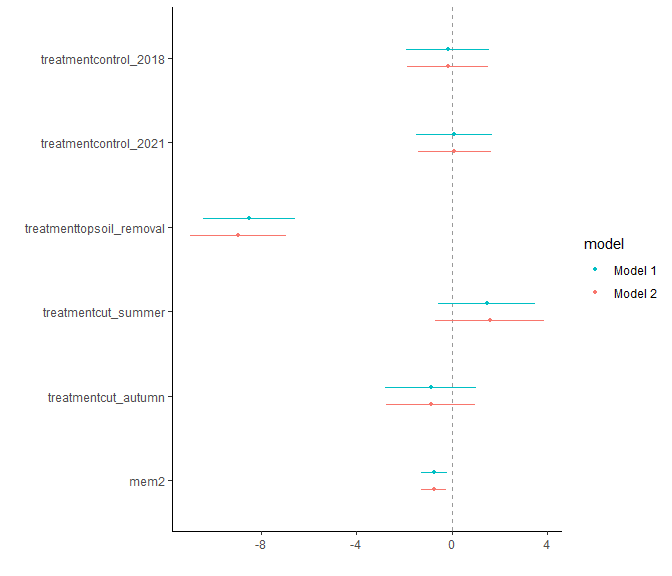<!-- -->

### Effect sizes

Effect sizes of chosen model just to get exact values of means etc. if
necessary.

``` r
(emm <- emmeans(
  m_2,
  revpairwise ~ treatment,
  type = "response"
  ))
```

    ## $emmeans
    ##  treatment    emmean    SE  df lower.CL upper.CL
    ##  control_2003  17.05 0.633 229    15.80     18.3
    ##  control_2018  16.88 0.633 229    15.63     18.1
    ##  control_2021  17.17 0.519 229    16.15     18.2
    ##  grazing        8.57 0.749 229     7.09     10.0
    ##  cut_summer    17.80 0.749 229    16.33     19.3
    ##  cut_autumn    16.20 0.749 229    14.73     17.7
    ## 
    ## Confidence level used: 0.95 
    ## 
    ## $contrasts
    ##  contrast                    estimate    SE  df t.ratio p.value
    ##  control_2018 - control_2003   -0.167 0.892 229  -0.187  1.0000
    ##  control_2021 - control_2003    0.119 0.818 229   0.146  1.0000
    ##  control_2021 - control_2018    0.286 0.818 229   0.349  0.9993
    ##  grazing - control_2003        -8.479 0.986 229  -8.602  <.0001
    ##  grazing - control_2018        -8.312 0.986 229  -8.433  <.0001
    ##  grazing - control_2021        -8.598 0.913 229  -9.414  <.0001
    ##  cut_summer - control_2003      0.754 0.986 229   0.765  0.9730
    ##  cut_summer - control_2018      0.921 0.986 229   0.934  0.9373
    ##  cut_summer - control_2021      0.635 0.913 229   0.696  0.9823
    ##  cut_summer - grazing           9.233 1.050 229   8.753  <.0001
    ##  cut_autumn - control_2003     -0.846 0.986 229  -0.858  0.9559
    ##  cut_autumn - control_2018     -0.679 0.986 229  -0.689  0.9831
    ##  cut_autumn - control_2021     -0.965 0.913 229  -1.056  0.8980
    ##  cut_autumn - grazing           7.633 1.050 229   7.236  <.0001
    ##  cut_autumn - cut_summer       -1.600 1.050 229  -1.517  0.6538
    ## 
    ## P value adjustment: tukey method for comparing a family of 6 estimates

``` r
plot(emm, comparison = TRUE)
```

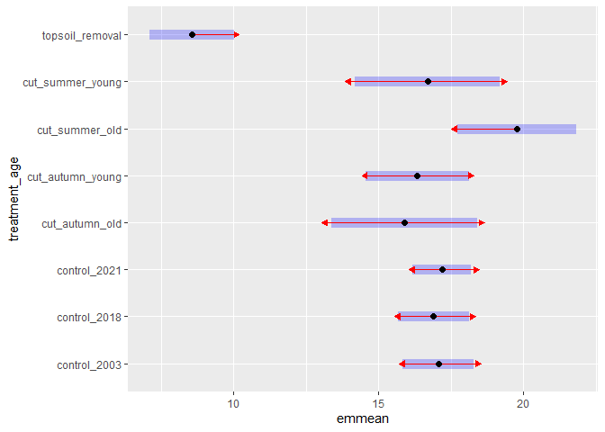<!-- -->

# Session info

    ## R version 4.5.0 (2025-04-11 ucrt)
    ## Platform: x86_64-w64-mingw32/x64
    ## Running under: Windows 11 x64 (build 26100)
    ## 
    ## Matrix products: default
    ##   LAPACK version 3.12.1
    ## 
    ## locale:
    ## [1] LC_COLLATE=German_Germany.utf8  LC_CTYPE=German_Germany.utf8   
    ## [3] LC_MONETARY=German_Germany.utf8 LC_NUMERIC=C                   
    ## [5] LC_TIME=German_Germany.utf8    
    ## 
    ## time zone: America/New_York
    ## tzcode source: internal
    ## 
    ## attached base packages:
    ## [1] stats     graphics  grDevices utils     datasets  methods   base     
    ## 
    ## other attached packages:
    ##  [1] emmeans_1.11.2   DHARMa_0.4.7     patchwork_1.3.1  ggbeeswarm_0.7.2
    ##  [5] lubridate_1.9.4  forcats_1.0.0    stringr_1.5.1    dplyr_1.1.4     
    ##  [9] purrr_1.1.0      readr_2.1.5      tidyr_1.3.1      tibble_3.3.0    
    ## [13] ggplot2_3.5.2    tidyverse_2.0.0  here_1.0.1      
    ## 
    ## loaded via a namespace (and not attached):
    ##  [1] Rdpack_2.6.4           gridExtra_2.3          rlang_1.1.6           
    ##  [4] magrittr_2.0.3         compiler_4.5.0         mgcv_1.9-1            
    ##  [7] vctrs_0.6.5            pkgconfig_2.0.3        crayon_1.5.3          
    ## [10] fastmap_1.2.0          backports_1.5.0        labeling_0.4.3        
    ## [13] utf8_1.2.6             ggstance_0.3.7         promises_1.3.3        
    ## [16] rmarkdown_2.29         tzdb_0.5.0             nloptr_2.2.1          
    ## [19] bit_4.6.0              xfun_0.52              later_1.4.2           
    ## [22] parallel_4.5.0         R6_2.6.1               gap.datasets_0.0.6    
    ## [25] stringi_1.8.7          qgam_2.0.0             RColorBrewer_1.1-3    
    ## [28] GGally_2.2.1           car_3.1-3              boot_1.3-31           
    ## [31] estimability_1.5.1     Rcpp_1.1.0             iterators_1.0.14      
    ## [34] knitr_1.50             parameters_0.27.0      httpuv_1.6.16         
    ## [37] Matrix_1.7-3           splines_4.5.0          timechange_0.3.0      
    ## [40] tidyselect_1.2.1       rstudioapi_0.17.1      abind_1.4-8           
    ## [43] yaml_2.3.10            MuMIn_1.48.11          doParallel_1.0.17     
    ## [46] codetools_0.2-20       lattice_0.22-6         plyr_1.8.9            
    ## [49] shiny_1.11.1           withr_3.0.2            bayestestR_0.16.1     
    ## [52] coda_0.19-4.1          evaluate_1.0.4         marginaleffects_0.28.0
    ## [55] ggstats_0.10.0         pillar_1.11.0          gap_1.6               
    ## [58] carData_3.0-5          foreach_1.5.2          stats4_4.5.0          
    ## [61] reformulas_0.4.1       insight_1.3.1          generics_0.1.4        
    ## [64] vroom_1.6.5            rprojroot_2.1.0        hms_1.1.3             
    ## [67] scales_1.4.0           minqa_1.2.8            xtable_1.8-4          
    ## [70] glue_1.8.0             tools_4.5.0            data.table_1.17.8     
    ## [73] lme4_1.1-37            mvtnorm_1.3-3          grid_4.5.0            
    ## [76] rbibutils_2.3          datawizard_1.1.0       nlme_3.1-168          
    ## [79] Rmisc_1.5.1            performance_0.15.0     beeswarm_0.4.0        
    ## [82] vipor_0.4.7            Formula_1.2-5          cli_3.6.5             
    ## [85] gtable_0.3.6           digest_0.6.37          farver_2.1.2          
    ## [88] htmltools_0.5.8.1      lifecycle_1.0.4        mime_0.13             
    ## [91] bit64_4.6.0-1          dotwhisker_0.8.4       MASS_7.3-65
