Garchinger Heide and restoration sites: <br> R22 indicator richness
================
<b>Sina Appeltauer, Markus Bauer</b> <br>
<b>2025-12-03</b>

- [Preparation](#preparation)
- [Statistics](#statistics)
  - [Data exploration](#data-exploration)
    - [Means and deviations](#means-and-deviations)
    - [Graphs of raw data (Step 2, 6,
      7)](#graphs-of-raw-data-step-2-6-7)
    - [Outliers, zero-inflation, transformations? (Step 1, 3,
      4)](#outliers-zero-inflation-transformations-step-1-3-4)
    - [Check collinearity part 1 (Step
      5)](#check-collinearity-part-1-step-5)
  - [Models](#models)
  - [Model check](#model-check)
    - [DHARMa](#dharma)
    - [Check collinearity part 2 (Step
      5)](#check-collinearity-part-2-step-5)
  - [Model comparison](#model-comparison)
    - [<i>R</i><sup>2</sup> values](#r2-values)
    - [AICc](#aicc)
  - [Predicted values](#predicted-values)
    - [Summary table](#summary-table)
    - [Forest plot](#forest-plot)
    - [Effect sizes](#effect-sizes)
- [Session info](#session-info)

<br/> <br/> <b>Markus Bauer</b>\*, <b>Sina Appeltauer</b>, <b>Malte
Knöppler</b>, <b>Maren Teschauer</b> & <b>Johannes Kollmann</b>

Technichal University of Munich, TUM School of Life Sciences, Chair of
Restoration Ecology, Emil-Ramann-Straße 6, 85354 Freising, Germany

\*<markus1.bauer@tum.de>

ORCiD ID: [0000-0001-5372-4174](https://orcid.org/0000-0001-5372-4174)
<br> [Google
Scholar](https://scholar.google.de/citations?user=oHhmOkkAAAAJ&hl=de&oi=ao)
<br> GitHub: [markus1bauer](https://github.com/markus1bauer) <br>
GitHub:
[TUM-Restoration-Ecology](https://github.com/TUM-Restoration-Ecology)

To compare different models, you only have to change the models in
section ‘Load models’

# Preparation

Protocol of data exploration (Steps 1-8) used from Zuur et al. (2010)
Methods Ecol Evol
[DOI:10.1111/2041-210X.12577](https://doi.org/10.1111/2041-210X.12577)

#### Packages

``` r
library(here)
library(tidyverse)
library(ggbeeswarm)
library(patchwork)
library(DHARMa)
library(emmeans)
```

#### Load data

``` r
sites <- read_csv(
  here("data", "processed", "data_processed_sites.csv"),
  col_names = TRUE, na = c("", "na", "NA"), col_types = 
    cols(
      .default = "?",
      year_hay_transfer = "f",
      treatment = col_factor(
        levels = c("control_2003", "control_2018", "control_2021", "cut_summer",
                   "cut_autumn", "topsoil_removal")
      ),
      treatment_age = col_factor(
        levels = c("control_2003", "control_2018", "control_2021", "cut_summer_old",
                   "cut_summer_young", "cut_autumn_old", "cut_autumn_young",
                   "topsoil_removal")
      )
    )
  ) %>%
  rename(y = richness_R22)

subset <- sites %>%
  mutate(
    hay_and_mowing_date = str_c(
      year_hay_transfer, mowing_date, sep = "_"
      )
    ) %>%
  filter(
    is.na(hay_and_mowing_date) | !(hay_and_mowing_date %in% c("1993_summer")),
    is.na(year_topsoil_removal) | year_topsoil_removal != "1996/2003"
    )
```

# Statistics

## Data exploration

### Means and deviations

``` r
Rmisc::CI(sites$y, ci = .95)
```

    ##    upper     mean    lower 
    ## 6.060940 5.593074 5.125207

``` r
median(sites$y)
```

    ## [1] 6

``` r
sd(sites$y)
```

    ## [1] 3.609016

``` r
quantile(sites$y, probs = c(0.05, 0.95), na.rm = TRUE)
```

    ##   5%  95% 
    ##  1.0 11.5

### Graphs of raw data (Step 2, 6, 7)

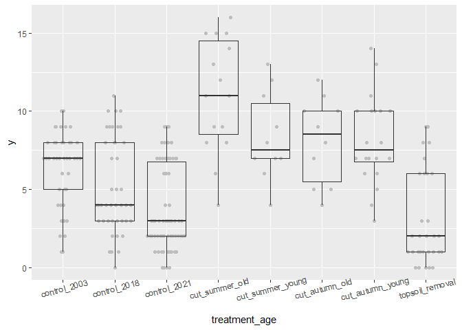<!-- -->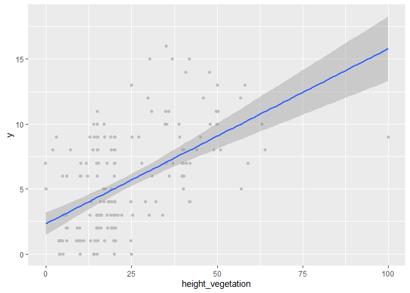<!-- -->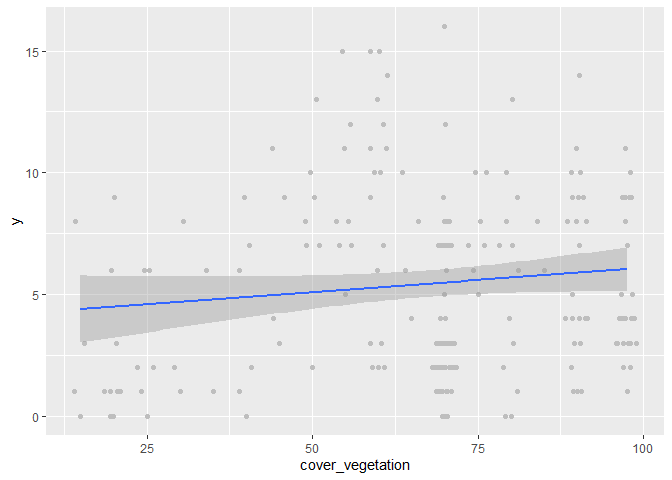<!-- -->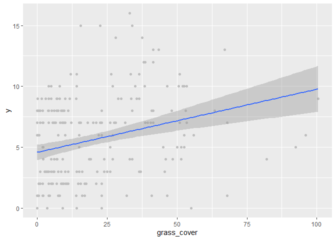<!-- -->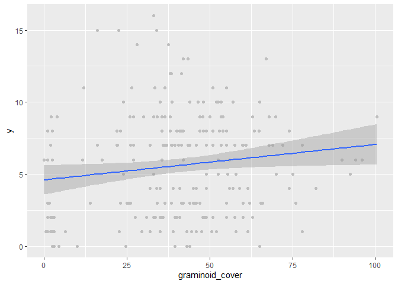<!-- -->

### Outliers, zero-inflation, transformations? (Step 1, 3, 4)

    ## # A tibble: 8 × 2
    ##   treatment_age        n
    ##   <fct>            <int>
    ## 1 control_2003        42
    ## 2 control_2018        42
    ## 3 control_2021        62
    ## 4 cut_summer_old      15
    ## 5 cut_summer_young    10
    ## 6 cut_autumn_old      10
    ## 7 cut_autumn_young    20
    ## 8 topsoil_removal     30

    ## `stat_bin()` using `bins = 30`. Pick better value with `binwidth`.

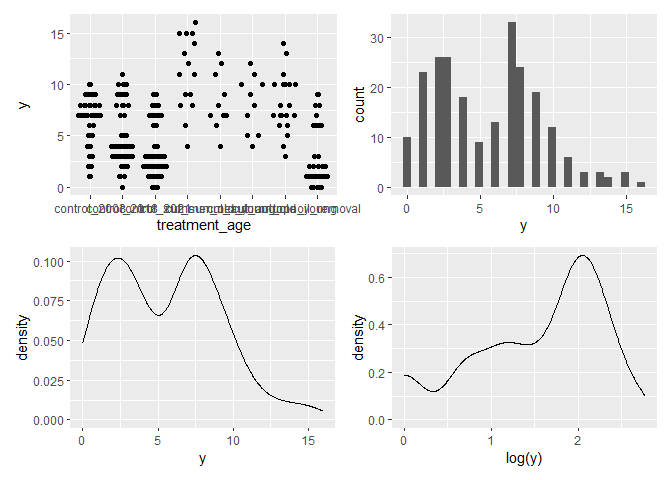<!-- -->

### Check collinearity part 1 (Step 5)

Exclude r \> 0.7 <br> Dormann et al. 2013 Ecography
[DOI:10.1111/j.1600-0587.2012.07348.x](https://doi.org/10.1111/j.1600-0587.2012.07348.x)

``` r
sites %>%
    select(
    cover_vegetation, height_vegetation, grass_cover, graminoid_cover, mem1,
    mem2
    ) %>%
  GGally::ggpairs(lower = list(continuous = "smooth_loess")) +
  theme(strip.text = element_text(size = 7))
```

<!-- -->

## Models

Only here you have to modify the script to compare other models

``` r
load(file = here("outputs", "models", "model_richness_r22_2.Rdata"))
load(file = here("outputs", "models", "model_richness_r22_2sub.Rdata"))
m_1 <- m2
m_2 <- m2sub
```

``` r
m_1
## 
## Call:
## lm(formula = y ~ treatment_age + mem2, data = sites)
## 
## Coefficients:
##                   (Intercept)      treatment_agecontrol_2018  
##                        6.3799                        -1.2143  
##     treatment_agecontrol_2021    treatment_agecut_autumn_old  
##                       -2.7427                         1.6917  
## treatment_agecut_autumn_young    treatment_agecut_summer_old  
##                        1.7417                         4.6583  
## treatment_agecut_summer_young   treatment_agetopsoil_removal  
##                        1.9917                        -3.4083  
##                          mem2  
##                       -0.0965
m_2
## 
## Call:
## lm(formula = y ~ treatment + mem2, data = subset)
## 
## Coefficients:
##              (Intercept)     treatmentcontrol_2018     treatmentcontrol_2021  
##                   6.3799                   -1.2143                   -2.7427  
## treatmenttopsoil_removal       treatmentcut_summer       treatmentcut_autumn  
##                  -3.4518                    3.4667                    1.7250  
##                     mem2  
##                  -0.0965
```

## Model check

### DHARMa

``` r
simulation_output_1 <- simulateResiduals(m_1, plot = TRUE)
```

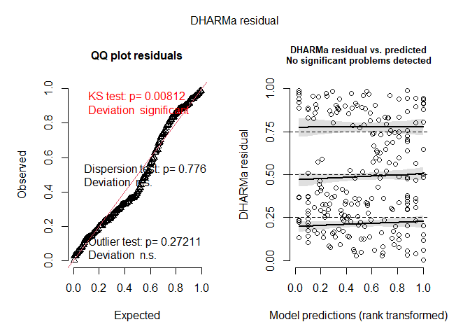<!-- -->

``` r
simulation_output_2 <- simulateResiduals(m_2, plot = TRUE)
```

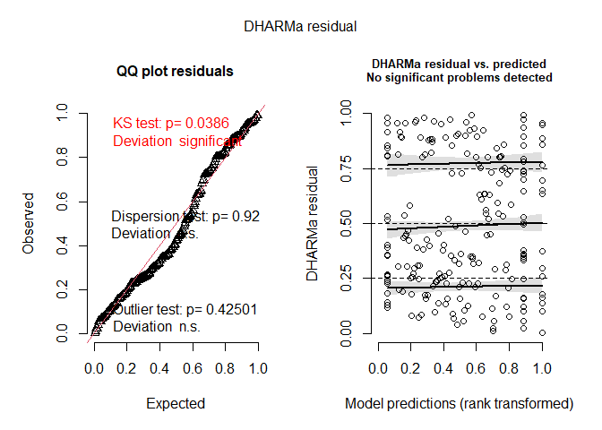<!-- -->

``` r
plotResiduals(simulation_output_1$scaledResiduals, sites$treatment_age)
```

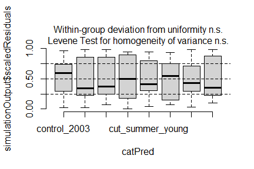<!-- -->

``` r
plotResiduals(simulation_output_2$scaledResiduals, subset$treatment) # dataframe subset
```

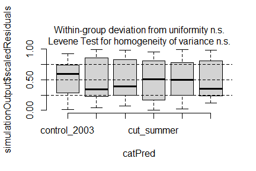<!-- -->

``` r
plotResiduals(simulation_output_1$scaledResiduals, sites$mem2)
```

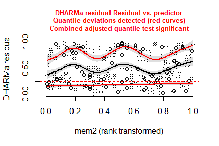<!-- -->

``` r
plotResiduals(simulation_output_2$scaledResiduals, subset$mem2) # dataframe subset
```

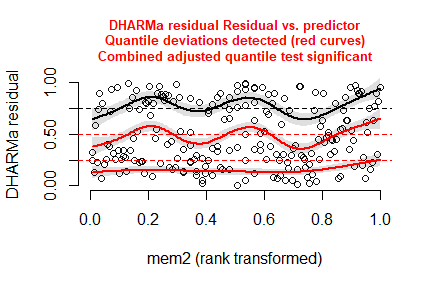<!-- -->

``` r
plotResiduals(simulation_output_1$scaledResiduals, sites$botanist)
```

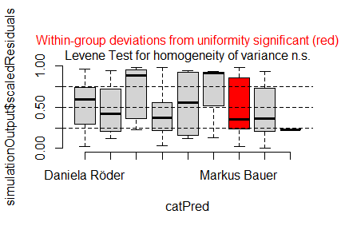<!-- -->

``` r
plotResiduals(simulation_output_2$scaledResiduals, subset$botanist) # dataframe subset
```

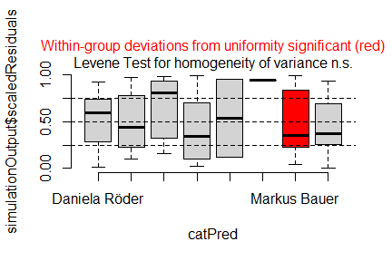<!-- -->

``` r
plotResiduals(simulation_output_1$scaledResiduals, sites$year_hay_transfer)
```

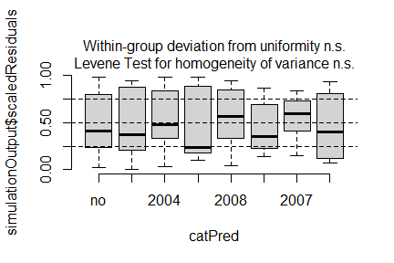<!-- -->

``` r
plotResiduals(simulation_output_2$scaledResiduals, subset$year_hay_transfer) # dataframe subset
```

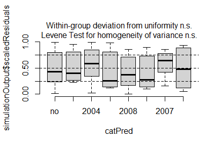<!-- -->

### Check collinearity part 2 (Step 5)

Remove VIF \> 3 or \> 10 <br> Zuur et al. 2010 Methods Ecol Evol
[DOI:10.1111/j.2041-210X.2009.00001.x](https://doi.org/10.1111/j.2041-210X.2009.00001.x)

``` r
car::vif(m_1)
```

    ##                  GVIF Df GVIF^(1/(2*Df))
    ## treatment_age 1.05719  7        1.003980
    ## mem2          1.05719  1        1.028197

``` r
car::vif(m_2)
```

    ##               GVIF Df GVIF^(1/(2*Df))
    ## treatment 1.050357  5        1.004925
    ## mem2      1.050357  1        1.024869

## Model comparison

### <i>R</i><sup>2</sup> values

``` r
MuMIn::r.squaredGLMM(m_1)
##            R2m       R2c
## [1,] 0.3913513 0.3913513
MuMIn::r.squaredGLMM(m_2)
##            R2m       R2c
## [1,] 0.3550319 0.3550319
```

### AICc

Use AICc and not AIC since ratio n/K \< 40 <br> Burnahm & Anderson 2002
p. 66 ISBN:
[978-0-387-95364-9](https://search.worldcat.org/de/title/845688581)

``` r
MuMIn::AICc(m_1, m_2) %>%
  arrange(AICc)
##     df     AICc
## m_2  8 1061.229
## m_1 10 1150.565
```

## Predicted values

### Summary table

``` r
summary(m_1)
```

    ## 
    ## Call:
    ## lm(formula = y ~ treatment_age + mem2, data = sites)
    ## 
    ## Residuals:
    ##     Min      1Q  Median      3Q     Max 
    ## -7.0667 -2.0000 -0.6503  2.5139  6.0000 
    ## 
    ## Coefficients:
    ##                               Estimate Std. Error t value Pr(>|t|)    
    ## (Intercept)                     6.3799     0.4415  14.451  < 2e-16 ***
    ## treatment_agecontrol_2018      -1.2143     0.6210  -1.955   0.0518 .  
    ## treatment_agecontrol_2021      -2.7427     0.5695  -4.816 2.71e-06 ***
    ## treatment_agecut_autumn_old     1.6917     1.0066   1.681   0.0942 .  
    ## treatment_agecut_autumn_young   1.7417     0.7799   2.233   0.0265 *  
    ## treatment_agecut_summer_old     4.6583     0.8621   5.403 1.68e-07 ***
    ## treatment_agecut_summer_young   1.9917     1.0066   1.979   0.0491 *  
    ## treatment_agetopsoil_removal   -3.4083     0.6879  -4.955 1.44e-06 ***
    ## mem2                           -0.0965     0.1925  -0.501   0.6167    
    ## ---
    ## Signif. codes:  0 '***' 0.001 '**' 0.01 '*' 0.05 '.' 0.1 ' ' 1
    ## 
    ## Residual standard error: 2.846 on 222 degrees of freedom
    ## Multiple R-squared:  0.3998, Adjusted R-squared:  0.3782 
    ## F-statistic: 18.49 on 8 and 222 DF,  p-value: < 2.2e-16

### Forest plot

``` r
dotwhisker::dwplot(
  list(m_1, m_2),
  ci = 0.95,
  show_intercept = FALSE,
  vline = geom_vline(xintercept = 0, colour = "grey60", linetype = 2)) +
  theme_classic()
```

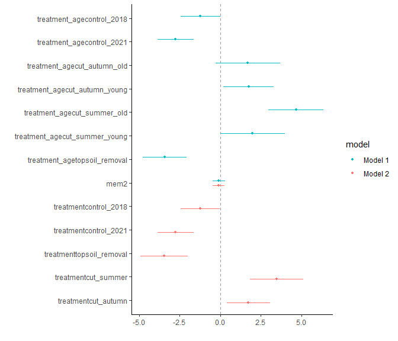<!-- -->

### Effect sizes

Effect sizes of chosen model just to get exact values of means etc. if
necessary.

``` r
(emm <- emmeans(
  m_1,
  revpairwise ~ treatment_age,
  type = "response"
  ))
```

    ## $emmeans
    ##  treatment_age    emmean    SE  df lower.CL upper.CL
    ##  control_2003       6.38 0.441 222     5.51     7.25
    ##  control_2018       5.17 0.441 222     4.30     6.04
    ##  control_2021       3.64 0.362 222     2.92     4.35
    ##  cut_autumn_old     8.07 0.902 222     6.29     9.85
    ##  cut_autumn_young   8.12 0.639 222     6.86     9.38
    ##  cut_summer_old    11.04 0.737 222     9.59    12.49
    ##  cut_summer_young   8.37 0.902 222     6.59    10.15
    ##  topsoil_removal    2.97 0.523 222     1.94     4.00
    ## 
    ## Confidence level used: 0.95 
    ## 
    ## $contrasts
    ##  contrast                            estimate    SE  df t.ratio p.value
    ##  control_2018 - control_2003           -1.214 0.621 222  -1.955  0.5145
    ##  control_2021 - control_2003           -2.743 0.569 222  -4.816  0.0001
    ##  control_2021 - control_2018           -1.528 0.569 222  -2.684  0.1330
    ##  cut_autumn_old - control_2003          1.692 1.010 222   1.681  0.6998
    ##  cut_autumn_old - control_2018          2.906 1.010 222   2.887  0.0802
    ##  cut_autumn_old - control_2021          4.434 0.973 222   4.559  0.0002
    ##  cut_autumn_young - control_2003        1.742 0.780 222   2.233  0.3361
    ##  cut_autumn_young - control_2018        2.956 0.780 222   3.790  0.0047
    ##  cut_autumn_young - control_2021        4.484 0.735 222   6.097  <.0001
    ##  cut_autumn_young - cut_autumn_old      0.050 1.100 222   0.045  1.0000
    ##  cut_summer_old - control_2003          4.658 0.862 222   5.403  <.0001
    ##  cut_summer_old - control_2018          5.873 0.862 222   6.812  <.0001
    ##  cut_summer_old - control_2021          7.401 0.822 222   9.002  <.0001
    ##  cut_summer_old - cut_autumn_old        2.967 1.160 222   2.553  0.1790
    ##  cut_summer_old - cut_autumn_young      2.917 0.972 222   3.001  0.0591
    ##  cut_summer_young - control_2003        1.992 1.010 222   1.979  0.4987
    ##  cut_summer_young - control_2018        3.206 1.010 222   3.185  0.0348
    ##  cut_summer_young - control_2021        4.734 0.973 222   4.868  0.0001
    ##  cut_summer_young - cut_autumn_old      0.300 1.270 222   0.236  1.0000
    ##  cut_summer_young - cut_autumn_young    0.250 1.100 222   0.227  1.0000
    ##  cut_summer_young - cut_summer_old     -2.667 1.160 222  -2.295  0.3009
    ##  topsoil_removal - control_2003        -3.408 0.688 222  -4.955  <.0001
    ##  topsoil_removal - control_2018        -2.194 0.688 222  -3.189  0.0343
    ##  topsoil_removal - control_2021        -0.666 0.637 222  -1.045  0.9669
    ##  topsoil_removal - cut_autumn_old      -5.100 1.040 222  -4.908  <.0001
    ##  topsoil_removal - cut_autumn_young    -5.150 0.822 222  -6.269  <.0001
    ##  topsoil_removal - cut_summer_old      -8.067 0.900 222  -8.963  <.0001
    ##  topsoil_removal - cut_summer_young    -5.400 1.040 222  -5.196  <.0001
    ## 
    ## P value adjustment: tukey method for comparing a family of 8 estimates

``` r
plot(emm, comparison = TRUE)
```

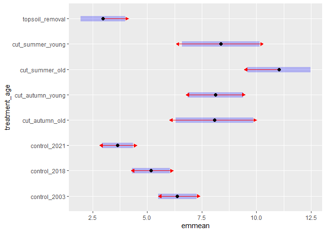<!-- -->

# Session info

    ## R version 4.5.1 (2025-06-13 ucrt)
    ## Platform: x86_64-w64-mingw32/x64
    ## Running under: Windows 11 x64 (build 26100)
    ## 
    ## Matrix products: default
    ##   LAPACK version 3.12.1
    ## 
    ## locale:
    ## [1] LC_COLLATE=German_Germany.utf8  LC_CTYPE=German_Germany.utf8   
    ## [3] LC_MONETARY=German_Germany.utf8 LC_NUMERIC=C                   
    ## [5] LC_TIME=German_Germany.utf8    
    ## 
    ## time zone: Europe/Berlin
    ## tzcode source: internal
    ## 
    ## attached base packages:
    ## [1] stats     graphics  grDevices utils     datasets  methods   base     
    ## 
    ## other attached packages:
    ##  [1] emmeans_1.11.2   DHARMa_0.4.7     patchwork_1.3.1  ggbeeswarm_0.7.2
    ##  [5] lubridate_1.9.4  forcats_1.0.0    stringr_1.5.1    dplyr_1.1.4     
    ##  [9] purrr_1.1.0      readr_2.1.5      tidyr_1.3.1      tibble_3.3.0    
    ## [13] ggplot2_3.5.2    tidyverse_2.0.0  here_1.0.1      
    ## 
    ## loaded via a namespace (and not attached):
    ##  [1] Rdpack_2.6.4           gridExtra_2.3          rlang_1.1.6           
    ##  [4] magrittr_2.0.3         compiler_4.5.1         mgcv_1.9-3            
    ##  [7] vctrs_0.6.5            pkgconfig_2.0.3        crayon_1.5.3          
    ## [10] fastmap_1.2.0          backports_1.5.0        labeling_0.4.3        
    ## [13] utf8_1.2.6             ggstance_0.3.7         promises_1.3.3        
    ## [16] rmarkdown_2.29         tzdb_0.5.0             nloptr_2.2.1          
    ## [19] bit_4.6.0              xfun_0.52              later_1.4.2           
    ## [22] parallel_4.5.1         R6_2.6.1               gap.datasets_0.0.6    
    ## [25] stringi_1.8.7          qgam_2.0.0             RColorBrewer_1.1-3    
    ## [28] GGally_2.2.1           car_3.1-3              boot_1.3-31           
    ## [31] estimability_1.5.1     Rcpp_1.1.0             iterators_1.0.14      
    ## [34] knitr_1.50             parameters_0.27.0      httpuv_1.6.16         
    ## [37] Matrix_1.7-3           splines_4.5.1          timechange_0.3.0      
    ## [40] tidyselect_1.2.1       rstudioapi_0.17.1      abind_1.4-8           
    ## [43] yaml_2.3.10            MuMIn_1.48.11          doParallel_1.0.17     
    ## [46] codetools_0.2-20       lattice_0.22-7         plyr_1.8.9            
    ## [49] shiny_1.11.1           withr_3.0.2            bayestestR_0.16.1     
    ## [52] coda_0.19-4.1          evaluate_1.0.4         marginaleffects_0.28.0
    ## [55] ggstats_0.10.0         pillar_1.11.0          gap_1.6               
    ## [58] carData_3.0-5          foreach_1.5.2          stats4_4.5.1          
    ## [61] reformulas_0.4.1       insight_1.3.1          generics_0.1.4        
    ## [64] vroom_1.6.5            rprojroot_2.1.0        hms_1.1.3             
    ## [67] scales_1.4.0           minqa_1.2.8            xtable_1.8-4          
    ## [70] glue_1.8.0             tools_4.5.1            data.table_1.17.8     
    ## [73] lme4_1.1-37            mvtnorm_1.3-3          grid_4.5.1            
    ## [76] rbibutils_2.3          datawizard_1.1.0       nlme_3.1-168          
    ## [79] Rmisc_1.5.1            performance_0.15.0     beeswarm_0.4.0        
    ## [82] vipor_0.4.7            Formula_1.2-5          cli_3.6.5             
    ## [85] gtable_0.3.6           digest_0.6.37          farver_2.1.2          
    ## [88] htmltools_0.5.8.1      lifecycle_1.0.4        mime_0.13             
    ## [91] bit64_4.6.0-1          dotwhisker_0.8.4       MASS_7.3-65
